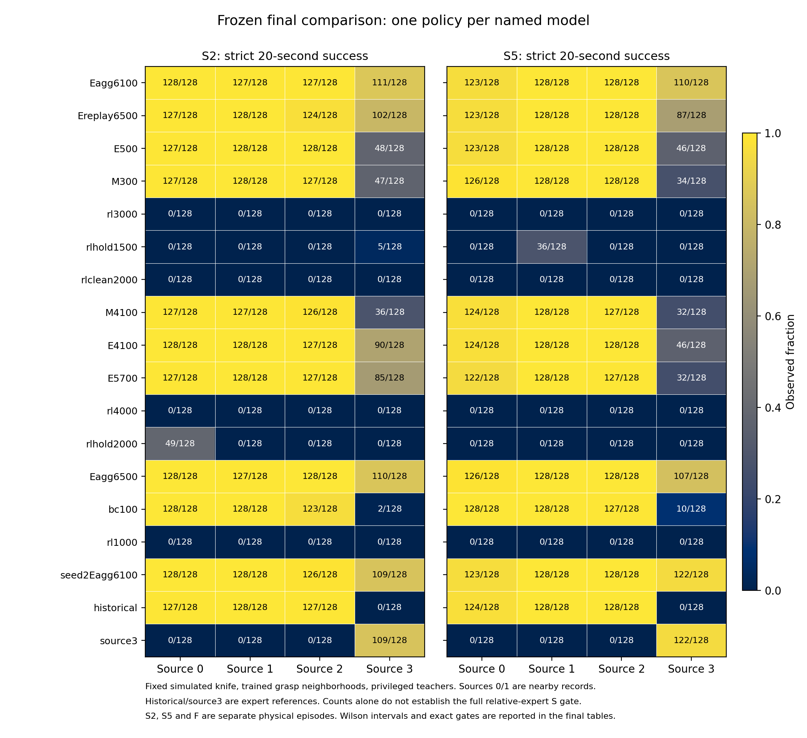
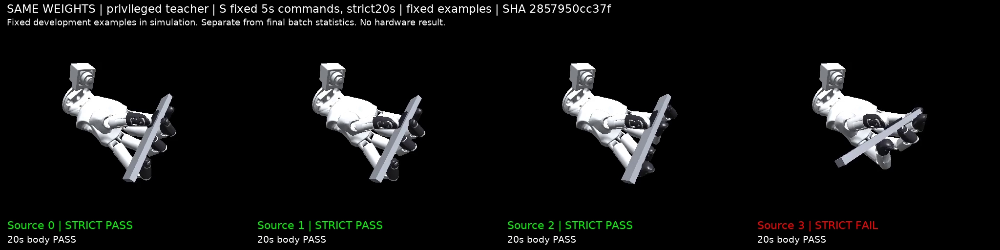

# Wuji 多抓姿滑块操作：审计、联合学习与冻结验证

**同一套 Eagg6100 特权 teacher 权重已在本轮新最终集上通过来源0/1/2/3的完整 S 严格保持门槛；固定第二优化种子也通过最终 S。** 直接联合 RL 学到了功能性伸缩，但本预算未解决严格持刀。执行动作监督比原始输出监督更好，小规模历史一致的数据聚合进一步改善闭环。所有结论限于当前固定仿真刀及已训练基础抓姿邻域。

本轮未训练 student；先完成了完整 teacher 第二种子路线与冻结验证。下一轮唯一优先项是核查可用观测后，将此统一 teacher 蒸馏为 student，冻结 actor，用新登记的验证集检查 F/S。当前最终集已关闭，不再用于训练、调参或选点。

## 最终主候选

每来源128例；各来源及各协议均使用同一模型，不根据来源切换专家、权重或控制器。S2、S5为分别运行的20秒固定时钟回合，F为另外运行的40秒到位换向回合。

|协议与指标|源0|源1|源2|源3|
|---|---:|---:|---:|---:|
| S2 完整严格成功 | 128/128 (100.0%) | 127/128 (99.2%) | 127/128 (99.2%) | 111/128 (86.7%) |
| S2 全20秒刀身稳定 | 128/128 (100.0%) | 127/128 (99.2%) | 127/128 (99.2%) | 126/128 (98.4%) |
| S5 完整严格成功 | 123/128 (96.1%) | 128/128 (100.0%) | 128/128 (100.0%) | 110/128 (85.9%) |
| S5 全20秒刀身稳定 | 124/128 (96.9%) | 128/128 (100.0%) | 128/128 (100.0%) | 127/128 (99.2%) |
| F 至少一轮伸出和收回 | 128/128 (100.0%) | 128/128 (100.0%) | 128/128 (100.0%) | 128/128 (100.0%) |
| F 全40秒刀身稳定 | 127/128 (99.2%) | 115/128 (89.8%) | 110/128 (85.9%) | 125/128 (97.7%) |

八个 S 格均满足严格成功≥80%、刀身稳定≥95%，相对同批负责专家的严格成功下降≤10个百分点、刀身下降≤3点。源3 S5为110/128，对应专家122/128，下降9.375点，距离相对门槛仅0.625点。门槛按观测比例判定，不代表真实成功概率的置信下界已超过80%。完整逐格计数、95% Wilson区间、存活和阶段指标见 [FINAL.md](FINAL.md)，精确判定见 [final-gates.json](final-gates.json)。

F四来源均128/128完成至少一轮，**不等于40秒全程稳定**：源1/2的刀身稳定只有115/128和110/128。20秒固定时钟的 S 达标，也不外推至任意时长或其他命令协议。

主候选路径：`runs/artmanip-recovery-20260930/aggregation1-pair6400/aggregate/E/epoch_006100.pth`。
SHA256：`2857950cc37f519bf5248fd46377475582993417fa194e89097804e5bc94aff8`。
它在打开最终集前，按登记的开发排序选出并通过独立64例复核；最终没有重新选点。[final-freeze.json](final-freeze.json) 固定18个模型、初态、协议及源码 `a36219f268ea7776aa58b034f7c82c219f3ba93e`。

## 各路线的最终比较

下表每个数字均以128为分母，四个数依次为来源0/1/2/3。保留固定预算末点；各路线选点、早期点、专家以及完整刀身/存活统计都在 [FINAL.md](FINAL.md)。

|模型与位置|S2严格|S5严格|F至少一轮|完整S门槛|
|---|---|---|---|---|
| 历史 BC100 起点 | 128, 128, 123, 2 | 128, 128, 127, 10 | 128, 128, 127, 128 | 未通过 |
| 原版风格 RL4000 末点 | 0, 0, 0, 0 | 0, 0, 0, 0 | 124, 127, 128, 128 | 未通过 |
| M 原始输出，新增32000更新 | 127, 127, 126, 36 | 124, 128, 127, 32 | 127, 128, 128, 126 | 未通过 |
| E 执行动作，同预算32000 | 128, 128, 127, 90 | 124, 128, 128, 46 | 128, 128, 128, 127 | 未通过 |
| E 延长至44800 | 127, 128, 127, 85 | 122, 128, 127, 32 | 128, 128, 127, 127 | 未通过 |
| 旧数据重放末点，再加6400 | 127, 128, 124, 102 | 123, 128, 128, 87 | 127, 128, 128, 128 | 未通过 |
| 数据聚合末点，再加6400 | 128, 127, 128, 110 | 126, 128, 128, 107 | 128, 128, 128, 128 | 未通过 |
| 预先选定主候选，再加3200 | 128, 127, 127, 111 | 123, 128, 128, 110 | 128, 128, 128, 128 | 通过 |
| 完整第二优化种子固定点 | 128, 128, 126, 109 | 123, 128, 128, 122 | 128, 128, 128, 128 | 通过 |

刀身与功能协议分别绘制：[S刀身稳定](final-figures/body.png)、[F循环和40秒刀身稳定](final-figures/functional.png)。图、PDF及CSV位于 [final-figures](final-figures)。

**直接 RL。** 从随机权重开始，使用全手增量控制、SAPG循环teacher、上游代码200→2000课程，完成四段共327,680,000环境交互和144,000次Adam更新，约为论文2B规模的16.4%。最终F为[124,127,128,128]/128，S2/S5严格成功及全程刀身稳定均为0。源3阶段到位、保持和首次越界时间仍有变化；结论是预算受限、严格目标未完成，不是收敛或方法无效，也不是类别级复现。

**同起点 M/E。** 两臂从历史BC100的真实800步Adam/RNG恢复，同数据、同LR/序列采样、冻结输入统计，同新增32,000更新；M监督专家原始μ，E监督裁剪后的执行动作，预测端不裁剪loss。E在同批最终源3S2/S5达到90/128、46/128，M为36/128、32/128，E改善但两者均未通过S。E独自延长到44,800更新没有进一步解决闭环：最终85/128、32/128。开发阶段32例中观察到的回退未在当时64例复现；不把一个检查点差异概括为普遍收敛结论。

**数据聚合。** 离线验证误差下降趋缓、闭环状态偏移及专家接管可用性检查触发了一轮采集。每个循环专家从同一reset沿实际行为历史维护RNN与各自归一化器，输入实际上一动作；同GPU全历史标签重放误差为0。接管诊断不是统一策略成功，也没有把专家当作任意状态下可靠的oracle。

聚合和旧数据重放从同一E5700模型/Adam/RNG出发，batch120、LR1e-5、共享验证集、各新增6,400更新，只替换20%的拟合历史。两个同预算6500末点，最终源3S2/S5分别为聚合110/128、107/128与重放102/128、87/128。**聚合6500仍未通过完整S**：源3S5相对专家122/128下降11.719点，超过10点。已在开发阶段选定的聚合6100通过最终门槛；未因最终结果重新选择它。新状态拟合改善伴随部分旧离线误差增大，而闭环改善，因此不能简单归因于模型容量。

**保持目标受控续训。** 从同一RL1000父点、同修复训练池出发，各新增81,920,000交互，比较原目标与固定时钟/持续保持目标。保持2000改善部分旧来源刀身：S2为[127,75,56,0]/128，S5为[119,90,52,0]/128；但源3未解决，源2F退化至1/128。原目标匹配对照同样未过S。它同时改变训练指令、奖励和时限，不能把差异归于单一奖励项；原始四段基线另行保留。

## 第二种子与开发证据

第二优化种子共享原专家、历史BC100权重及Adam，仅在路线开始时重置一次CPU/CUDA/NumPy采样随机状态；完整重复E44,800更新、自己的512回合采集及聚合3,200更新，随后固定终点。它检验优化及新数据采集的重复性，不是独立专家预训练或随机网络初始化。

第二种子最终S2严格[128,128,126,109]/128，S5[123,128,128,122]/128，八格绝对与同批专家相对门槛均通过；F四来源128/128。其64例开发复核曾因源1S2刀身62/64对专家64/64，下降3.125点而未过3点门槛，**该失败保留，未放宽标准**。两次不同队列的结果分别报告，不用最终通过改写开发失败，也未把第二种子换成主候选。

[DEVELOPMENT.md](DEVELOPMENT.md) 保留所有开发点、固定末点、阶段指标与区间；[development-curves](development-curves) 提供曲线/PDF/CSV；[STRICT64.md](STRICT64.md) 是主候选独立64例复核；[SECOND_SEED.md](SECOND_SEED.md) 和 [REPLICATION64.md](REPLICATION64.md) 保留第二种子链路与原判定。完整阶段叙述见 [DEVELOPMENT_NARRATIVE.md](DEVELOPMENT_NARRATIVE.md)。

## 审计与验证边界

论文、上游默认、既有Wuji和实际参考的差异见 [UPSTREAM_AUDIT.md](UPSTREAM_AUDIT.md)。实际全增量步长为0.00833333 rad/策略调用、控制周期0.0333333秒；论文1/40与代码有效步长分别记录。参考使用上游随机到位保持/换向、默认课程，保留明确修复的奖励切换时序；Wuji驱动、接触与刀物理参数没有冒充实物标定。BC保持原Wuji混合动作接口。RL与BC的系统比较同时包含接口、观测、奖励和指令差异，不能作单项因果归因。

原512行训练池的静态审计发现源0四个不稳定扰动；原四段基线保留它们，后续同池对照仅修复训练行。开发、复核和最终状态不筛选。没有直接驱动物体slider或锁住刀身。

S要求每阶段末9步误差均<2mm，全程有效存活、漂移<10mm、旋转<0.25rad，外部固定2/5秒换向。F采用10mm容差、连续到位1.5秒后换向，单独40秒回合。来源0/1是近邻，0/1、2、3按三个基础构型簇另作统计，不称四种独立形态。

18模型×3协议×4来源×128例，共27,648回合，全部来自一次打开的冻结最终集。原始归档已实际恢复，独立实现复算S评分和F状态机，与原报告逐回合一致；权重、初态、源码、协议、512行无过滤覆盖及唯一回合检查通过。证据：[final-analysis](final-analysis)、[final-integrity.json](final-integrity.json)、[final-decision.json](final-decision.json)。复算前SSH动态库冲突已修复，只重试CPU前置检查，没有重跑最终物理回合。

源码/资产、训练拟合、开发评估、冻结最终、独立复算、视频演示分别保留。未验证未见抓姿、其他刀型、自主取刀或真机；student尚未训练。

## 固定四来源视频与失败例

以下均使用主候选同一权重，固定开发初态，RTX4090上另行重仿真，完整600帧/20秒；四列标明来源、teacher、协议和实际结果。三段视频的源0/1/2严格通过，源3严格失败；四来源刀身均稳定。没有按视频重选权重或初态，也不以展示回合替代H200的最终统计。

|视频|固定开发行|结果证据|
|---|---|---|
|[S2 四来源](https://github.com/Jr-kelly/artgym/releases/download/wuji-artmanip-recovery-20260930-v1/recovery-teacher-S2.mp4)|0,32,64,96|[元数据](videos/recovery-teacher-S2.json)|
|[S5 四来源](https://github.com/Jr-kelly/artgym/releases/download/wuji-artmanip-recovery-20260930-v1/recovery-teacher-S5.mp4)|0,32,64,96|[元数据](videos/recovery-teacher-S5.json)|
|[预先固定的 S5 失败例](https://github.com/Jr-kelly/artgym/releases/download/wuji-artmanip-recovery-20260930-v1/recovery-teacher-S5-failure.mp4)|0,32,64,97|[元数据](videos/recovery-teacher-S5-failure.json)|

原H200源3第97行失败在打开最终集前固定：四个目标均曾到达，刀身最大位移4.46mm、旋转0.1105rad，但第一次伸出阶段末保持未达标。该原始轨迹及独立CSV见 [failure-figure](failure-figure)，与后来的视频重仿真分别记录。

## 预算、恢复与交付

GPU工作已结束：注册占卡22.4177 GPU小时，含0.05小时保守预检余量为22.4677，小于24；最大并发2卡。远端监控最后四小时整机均值30.51%，完整无采样缺口，达到26%门槛、未达到40%运行目标；全观测窗口35.99%。本地视频窗口仅395秒、整机均值53.23%，不能声称具备完整四小时统计。19:39 UTC已核验无自建GPU作业及监控，保留用户ToDesk桌面。详见 [resources/final-budget.json](resources/final-budget.json)、[remote-cleanup.json](remote-cleanup.json)、[local-cleanup.json](local-cleanup.json)。

代码分支：[feat/wuji-artmanip-recovery-20260930](https://github.com/Jr-kelly/artgym/tree/feat/wuji-artmanip-recovery-20260930)。权重、数据、原始轨迹及视频通过 [本轮Release](https://github.com/Jr-kelly/artgym/releases/tag/wuji-artmanip-recovery-20260930-v1) 分发；原训练、历史Release和网站保留。

快速恢复主候选可下载 [约69MB独立归档](https://github.com/Jr-kelly/artgym/releases/download/wuji-artmanip-recovery-20260930-v1/recovery-primary-candidate-Eagg6100.tar.gz)，归档SHA256 `3fa51b91d03e7cb795f9b8a27bd3d7b0fd81233e0c5137ea2753901025cf2d31`。它包含真实模型、48,800步Adam和RNG；完整最终权重包包含全部18个冻结模型。

[REPRODUCE.md](REPRODUCE.md) 给出恢复、实际训练命令及离线最终复算入口；[weights-index.json](weights-index.json) 索引实际权重和归档。[STATE.json](STATE.json)、[HANDOFF.md](HANDOFF.md)、[DECISIONS.jsonl](DECISIONS.jsonl) 维护带时间的预算、进程和下一步。发布后补交的公网下载/实际恢复核验记录与最终交付状态以分支最新提交为准。
