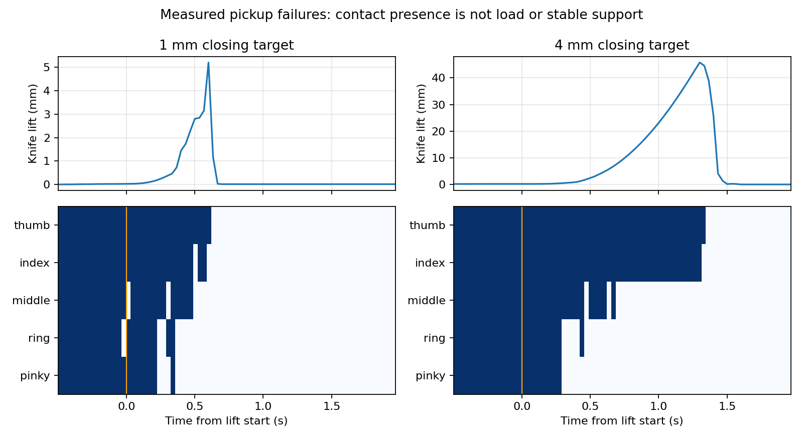

# 拇指与四指分列两侧的获取路线

## 当前实测状态（持续更新）

本轮新功能抓姿尚未成功获取；未进入翻掌、展指托刀或伸缩。现有旧成功链路、冻结模型和视频保持不变。

| 开发试验 | 变化 | 最高抬高 | 1秒抬起保持 | 后续阶段 |
|---|---|---:|---|---|
| F1-01 | 初始五指侧夹，1mm几何电机预压 | 5.21mm | 失败 | 未进入 |
| F1-02 | 仅预压改4mm | 45.76mm | 失败 | 未进入 |
| F1-03 | 均衡纵向接触+对应安全开合路径 | 132.52mm | 失败 | 未进入 |
| F1-04 | F1-03闭合后增加1秒停稳 | 167.87mm | 失败 | 未进入 |
| F1-05 | F1-03加入有界真值手指跟随 | 38.75mm | 失败 | 未进入 |
| F1-06 | F1-03重新分配闭合目标到无名/小指 | 119.50mm | 失败 | 未进入 |

上表F1-01至F1-06全部使用原147×19×11mm整体资产，不是新170×30×8mm资产。各行是同一摆放的一次开发执行，不能作为独立几何泛化率。预压数字是规划中的电机目标几何量，不是实测夹持力；最高高度不等于抓取成功。指标/物性未放宽，无本轮新训练。

[增量Release（全程视频、失败和原始证据）](https://github.com/Jr-kelly/artgym/releases/tag/g2-wuji-finger-surface-20260928-v1) · [原样保护的成功版本](https://github.com/Jr-kelly/artgym/releases/tag/g2-wuji-local-policy-20260928-v1)




用户补充：抓取时拇指与其余四指分列刀身两侧，抬起翻掌后手形更平，由四个非拇指支撑刀身，再由拇指调整和操作。

保留已成功获取/操作分支及视频。新分支先做有界几何核查，不将整体腕部旋转当成物体相对手的调整。翻掌不会自动将侧面接触变成底面支撑；需要检查逐步展指时真实接触迁移及拇指何时可以释放。

## 预声明的首轮几何筛查

最多3个确定性求解初值：原三指抓取的腕姿固定、允许该腕姿附近有限平移/旋转、同样有限腕姿范围但从较少远端弯曲的关节初值求解。均使用原Wuji一代限位、实际刀身147×19×8mm、滑块朝下自然落稳后的物体姿态和原75cm桌面。拇指目标在刀身-x侧，另四指在+x侧；四指按刀身长轴排列。原始方案明确未启用食指/小指夹取，不能把原方案换个标签当作新四指夹取成功。

新求解仅允许指腹pad朝向刀具的表面，避免用指背/近端链接接触冒充指面抓取。拟合考虑全手凸包顶点桌面高度、刀身/滑块几何、指面法向和原关节限位。初筛要求五个指面目标误差≤1mm、全手最低桌面间隙≥0.5mm、指面朝向正确；再检查指间/掌部碰撞、G2可达和路径。正向几何证据不能替代动力学保持。

本轮先执行CPU几何筛查，0新增训练。没有通过抓取触达与碰撞预检前，不启动物理试验。若后续确需物理开发，仍记录并沿用上一轮剩余8次控制预算，不自动追加第五训练配置。

首轮3个求解完成。固定腕姿的食指误差20.16mm；允许有限腕部调整后，两个候选五指误差均<0.6mm，但最低桌面间隙0.442–0.460mm低于预声明0.5mm，拇指朝向余弦0.219–0.234低于0.3。0/3通过，0物理执行，不放宽门槛。

有明确新的求解解释：软残差优化允许牺牲微小桌面间隙和拇指朝向换取较小总误差。追加一次CPU硬约束求解，以较少弯曲初值候选为起点，保持同样的±25mm/各轴±0.35rad腕搜索范围、1mm触达/0.5mm桌隙/0.3朝向门槛和原关节限位。改用SLSQP显式不等式，最多160轮；不新增动力学调参或训练。即使通过仍须检查完整凸包碰撞和机械臂路径。


## 已完成结果

4次CPU几何求解已结束，0物理执行/0训练。硬约束候选五指接触目标误差0.069/0.508/0.271/0.211/0.159mm，掌侧法向朝下分量-0.935。桌面最小间隙0.499999998mm恰在0.5mm边界附近，数值预检保留false，没有改阈值宣称通过；SLSQP达到160轮上限，未报告收敛。

随后仍执行只读的精确凸包核查用于定位障碍：270对非相邻手链接没有检出体积相交；G2实际资产单初值IK位置误差约2.4e-9m、旋转1.5e-8rad，机械臂/掌与桌面盒无相交。但食指、中指和无名指link4与刀身存在凸包交集，交集内切球半径分别0.828/0.791/0.751mm；拇指与小指pad也有约0.128/0.115mm交集。内切球半径不是碰撞穿透深度或实测接触力。拇指和小指joint4接近原限位。该候选明确不能进入物理执行。

软目标点与顶点避障不足以约束完整凸包的边/面相交，这是具体的规划问题；本轮没有关闭碰撞或通过驱动预压掩盖它。也不能从4次局部求解否定整条用户路线。

用户路线现作为新分支主目标：

1. 掌心向下，拇指与其余四指分列刀身两侧，检查普通桌面上的五指侧夹和抬起。
2. 空中由机械臂带动翻掌，先保持必要的拇指对压。
3. 四指逐步展平并在刀身下方形成分布式指面支撑。手腕整体转平不会自动改变手内接触，需要真实的接触迁移。
4. 四指支撑达到保持要求之后，拇指迁移/调整到滑块，接伸缩控制。

新目标不强制使用旧预置A的弯曲关节角。下一项唯一优先：在侧夹规划中加入完整凸包碰撞约束，并允许各指在刀身长度方向选择落点，避免为迁就原三指方案的固定纵向点把关节推到限位。仅当前候选的触达、腕姿可达已获得几何证据，抓取/翻掌/展平没有新增物理成功。

全部新增求解和审计文件见 [side-pinch-evidence](g2-finger-surface-20260928/side-pinch-evidence/)。几何复现：

```bash
cd /data/research/artgym-g2-finger-surface-20260928
bash scripts/g2_local_python.sh -m scripts.plan_g2_four_finger_side_pickup \
  --source-plan configs/g2_local/prefix/acquisition-candidate2-refined-initial.json \
  --localization /data/research/artgym-g2-local-policy-20260928/runs/g2-local-policy-20260928/R7-03-continuous-learned-H-then-joint-S/settled-table-localization.json \
  --output runs/g2-finger-surface-20260928/my-side-pinch-screen
# Add --constrained-refine <first-screen>/bounded-wrist-less-flexed-seed.json
# and use a new output directory for the single hard-constraint follow-up.
```

## 针对完整几何相交的单次跟进

2026-09-28 15:01 CST：不直接进入物理。以硬约束候选为起点，追加1次CPU求解：五个接触点各允许沿刀长±20mm（仍在刀端内5mm），四指点保持至少12mm纵向间距；原腕搜索范围和关节限位保持。将整个手链接凸包对刀身/滑块的正分离平面作为显式约束（≥10µm，仅作规划净空，非碰撞参数），加入桌隙0.55mm与朝向0.32的内部规划裕量，最终评价仍用原0.5mm/0.3门槛。最多160轮，保留失败。该求解专门检验“固定旧纵向点＋顶点避障”是否导致当前相交，不是新增控制/物性调参。


上述第5次几何求解已结束：纵向可调方案的SLSQP子问题提前失败，最大接触误差4.679mm；仍有食指/无名指远端及拇指等凸包相交，不能执行。它改善了一些相交量却损失了触达，不能称路线不可行，更不能改摩擦或关节限制强行运行。当前局部求解还受旧三指腕姿附近的初值和搜索范围限制，下一项应以掌心朝下、五指共同侧夹、关节留余量的构型重新建立求解初值，同时保留完整凸包避障与纵向落点选择；不继续重复同一个失败SLSQP初值。

至此共5次只读CPU几何求解、2次完整凸包/G2审计，0新物理、0新训练。已有成功链路和demo未被修改。

## Goal继续：新的五指共同侧夹初值

2026-09-28 15:15 CST：原生Goal已active。保留旧轮剩余8次物理开发/4配置已用满/墙钟截止29日01:53:41，几何仍单独计数。新的有界CPU筛查12个预声明初值：四指弯曲0.45/0.7rad、掌朝下绕刀长初始倾角-0.3/0/+0.3rad、2个独立采样得到的正向拇指初值。腕位置范围刀坐标x[-170,-65]mm、y[-100,-20]mm、z±25mm；朝向相对标准掌心朝下各轴±0.6rad；所有关节保留0.015rad限位余量。纵向接触点在各指允许区间自由选择，不再绑定旧三指点。全凸包分离平面、桌面和指面朝向共同拟合；两级有界求解每个65+110迭代。物理门槛不变；几何接受后还需精确手内相交/G2路径核查。求解失败全部保留。

## 新初值结果与接触高度核查

2026-09-28T07:19:26.926366+00:00：12个新初值全部结束，0/12通过。09–11四指误差约0.2mm，拇指约1mm，但桌隙约0mm，腕y/z触及规划边界。这里的接触目标y=-1mm为旧规划的人为固定线，并非用户要求或刀具唯一可接触面。预声明仅追加2次CPU跟进，从09和11分别开始，允许接触在真实侧面的y[-3,+2]mm内选择（离8mm厚刀边至少1mm），扩展腕部规划盒而不改G2/Wuji物理限位；仍要求1mm触达、0.5mm桌隙、0.3指腹朝向及完整凸包不相交。先软求解再180次SLSQP硬约束。全部结果保留；没有通过完整几何/路径前不消耗物理试验。

2026-09-28T07:21:02.613399+00:00：两次侧面高度可选的跟进均通过初筛（最大接触误差0.233mm，桌隙0.662mm）。00完整审计发现thumb link3与掌体相交，交集内切球半径1.172mm；刀身/滑块无相交、G2可达。新证据明确为手内碰撞：仅追加1次CPU求解将该对凸包分离直接加入约束，仍保留其余条件；然后再次审计全部270对。不得以碰撞过滤忽略该相交。

2026-09-28T15:23:54.512951+08:00：thumb/palm修正后完整270对自碰撞及刀具碰撞均通过；G2接近/抬起/180度翻掌规划通过。张手5mm→触达插值的最低桌隙0.4956mm，略低0.5mm，不放宽门槛。下一次仅在开/闭关节目标拟合中加入中间帧桌隙约束，同时审计运行器实际open→close直插路径。闭合1mm为电机目标几何压入量而非实测力，保持原驱动和限位。仍0物理。

2026-09-28T07:25:14.568309+00:00：v2关节路径加入中间帧净空后通过：103个手部采样构型、65个竖直接近高度均未检出需要拒绝的相交/桌隙问题，G2接近、抬起30cm和180度翻掌IK通过。预声明第1次物理F1-01（累计第73/80）：普通平桌、原摆放、五指5mm张开/1mm电机几何预压、取刀后1s固定世界/手内参考保持，再翻掌。仅获取诊断，不进入策略或宣称功能抓取成功。控制参数/物性均沿用基线。

2026-09-28T07:28:22.975917+00:00：F1-01完成，未取起：刀最高仅比落稳高5.21mm，抬起开始0.6s内所有接触丢失。闭合后五指均触刀侧，法向主要沿宽度，实际凸包触点接近目标，腕位误差约1mm以内，未发现关节顺序或坐标系错位。手指原刚度约0.18–0.69Nm/rad，实测关节误差约0.013rad；不是实测夹持力。接近末段食/中指存在短暂桌接触；闭合末段已无桌接触。预声明单因素F1-02：几何闭合目标压入1→4mm，不改质量、摩擦、刚度或限位，原张手/腕路径一致；几何通过后才执行。F1-01无翻掌、无策略，完整视频和失败轨迹保留。

2026-09-28T07:32:42.149331+00:00：F1-02失败，最高抬高45.76mm，仍未到抬高/保持门槛。前180帧q/arm/object/targets与F1-01逐位相同，成立单因素对照。闭合末0.5s五指全接触；抬起后无名/小指先失去，中指随后失去，仅拇指/食指暂留，约1.3s后全部掉落。实际接触纵向：thumb+16.1、index+22.1、middle-7.5、ring-28.0、pinky-52.3mm，thumb与四指均值相差约32.5mm。这是需检验的力臂布局假设，不已证实唯一原因；不再盲目增压。预声明一次CPU修正：thumb与四指接触纵向均值差≤4mm，保持桌隙/碰撞/原限位，腕规划z下界只扩展到-85mm；若几何通过，仍以4mm闭合、原驱动执行。布局变化是下一物理不同方案。

2026-09-28T15:34:42.379738+08:00：纵向均衡候选静态可行，thumb与四指中心差<1µm，完整碰撞无相交。但原5mm横向张开路径令食指触桌，+180度G2翻掌在第157/300帧触关节限位，故未消耗物理。下一次有界CPU路径修正：张手时指腹额外向桌上方退4mm，闭合明确经过触达关节中点（2s接触+1s预压），比较等价的-180度翻掌方向。此为真实电机路径规划；没有移动或复位刀具。

2026-09-28T15:37:00.829400+08:00：均衡方案的两个路径都拒绝。具体障碍：食指joint1/2/4接近边界（仅0.015rad裕量），无足够张开空间；+180翻掌joint7上限、-180翻掌joint4下限。预声明仅1次几何结构跟进：将关节规划裕量收紧为0.08rad、thumb/四指纵向偏差目标改为≤10mm（仍远小于原32.5mm，但这是布局设计条件，非任务成功判据），腕x规划允许至-40mm以缓解手内触达。原物理限位和碰撞保持，不执行不合格轨迹。

2026-09-28T15:39:28.218146+08:00：0.08rad裕量候选触达/刀具/桌面初筛通过，但完整核查发现中/无名/小指14对自碰撞，不能进入物理。一次针对性CPU跟进加入这些相交对的完整凸包分离约束，并要求四指纵向至少20mm间距；目标均衡和原物理条件保持。已有两个成功取刀前缀的物性与代码均未覆盖。

2026-09-28T15:42:07.220407+08:00：加入14对分离后，完整270对/刀具精确审计无相交，thumb与四指均值差8.00mm，关节留0.08rad。优化达180轮上限；布点预检false原样保留，原因是最小20mm间距计算为19.999999999866mm，比规划设计值低约1.3e-10mm。该布局间距是本次防碰撞设计参数，不是操作成功阈值；不重写false或宣称物理通过。鉴于完整凸包审计通过，仅继续更强的路径检查，保留数值状态。

2026-09-28T15:44:34.411721+08:00：均衡无自碰撞触达姿态的动作检查还发现闭合预压末段中/无名link3擦碰（交集内切球半径14–22µm）；桌隙通过。翻掌第186帧触joint7上限，另用12初值全局IK也未找到该目标的可行解，不能仅归咎于跟踪分支。下一有界路径跟进：闭合优化显式保持已知指间分离；翻转轴改为刀长轴的固定水平投影（仍180度，普通空中机器人电机动作，slider面将翻到上方）。保留原腕前向轴拒绝证据，不改物性/限位。

2026-09-28T07:47:37.384183+00:00：当前均衡方案手部整个张开/闭合路径通过，G2接近与抬起通过；刀长轴翻掌±号和一次朝躯干10cm平移均未通过。先不扩大翻掌搜索，预声明F1-03物理仅执行桌面取刀→抬起→1s固定参考保持，直接检验上游支撑假设。保持门槛10mm/0.25rad不变，原4mm电机几何预压/物性不变；动作方案明确变为新均衡布局及其安全开合路径，不当作仅一个关节参数的单因素因果结论。无翻掌/策略成功宣称。累计75/80开发。

2026-09-28T07:51:03.400087+00:00：F1-03仍失败，最高抬高132.52mm；闭合末所有五指接触，初始lift约1s仍五指接触，随后ring/pinky先失去。闭合末实测最大手指速度0.527rad/s，lift开始0.37s达1.10rad/s；手物转动迅速到0.11–0.16rad，接触可能先受瞬态重排影响。初态闭合slider实际被动打开，最终约13.93mm，不复位且不计操作成功。预声明F1-04单因素增加闭合后1s原地停稳，其他计划/驱动/物性不变，再看闭合末速度与抬起保持。累计76/80，仍未进入翻掌或策略。

2026-09-28T07:59:44.665825+00:00：F1-04仍失败，最高抬高167.87mm；前270帧与F1-03逐位一致，但1s停稳后最大手指速度仍0.477rad/s（此前0.527），未证实等待能消除瞬态。新F1-05只相对F1-03加入有界指尖运动学反馈：桌面取刀原样，刀实际离桌20mm后，用仿真刀/腕真值跟随手内接触变换；首帧电机连续、每步≤0.01rad、总修正≤0.12rad，原限位/物性不变，动作经完整非邻接凸包和桌隙检查。离线记录回放只验证动作构造/边界，不计物理成功；先面分离失败再完整凸包核查，避免把缺少边轴的保守未认证当真实相交。独立1s保持固定世界/手内参考仍10mm/0.25rad，不随反馈刷新。特权控制上界，不是student部署/新训练。累计77/80，剩3次。

2026-09-28T08:03:21.688176+00:00：F1-05反馈失败且更早掉落，最高抬高38.75mm；真实命令在第296帧首次区别F1-03，124个激活帧均有合法修正，最大修正触0.12rad边界。不是避碰拦截导致未执行，也不能据此否定所有反馈；不继续增大该跟随器增益。下一唯一有界控制检验预声明：相对F1-03仅把侧夹预压分配从[4,4,4,4,4]改成[4,2,4,6,6]mm（顺序thumb/index/middle/ring/pinky），检验降低食指主导、增加先丢失的ring/pinky支撑是否有益。这是电机目标分配，不当成实测力；先完整路径避碰，最多1次物理，不继续扫参数。无新训练。

2026-09-28T16:05:11.986877+08:00：重新分配的闭合路径软拟合仍在中/无名指间产生14–87µm交集内切球半径，未执行物理。只追加一次显式硬约束闭合路径拟合，保持[4,2,4,6,6]mm请求不变，要求中途/终点原桌隙和凸包分离；160轮上限。若仍无可执行路径，保留为具体几何阻塞，不以关闭碰撞运行。

2026-09-28T08:08:22.954538+00:00：硬约束拟合达到160轮上限，保留未收敛状态；最终中/无名接触目标误差0.592/0.662mm，完整手内/桌面采样路径通过，张手/触达/腕姿与F1-03逐位相同。预声明F1-06只更新重新分配的闭合目标，仍仅取刀+保持，无翻掌或策略。累计78/80，剩2次，不继续压力网格搜索。

2026-09-28T08:11:41.119340+00:00：用户提供约170×30×8mm整体/45mm按钮本体长度、中央凸起存在；其余参数未测。停止继续旧刀尺寸调参，运行中的F1-06已按原资产终结失败（最高119.50mm）；其sourcepin与资产哈希保留。新独立资产knife_wuji_measured_envelope_20260928_v1：凸型收窄刀柄、45mm按钮、中央凸起三碰撞组件；主假设8mm包含凸起，暂分配6+1+1mm，不重复叠高；按钮宽12mm、凸起10×8×1mm及收回中心z=-20mm均显式假设，关节50mm行程/40mm操作幅度只继承对照，不由按钮长推断。原35g总质量/摩擦等仍未标定且不从尺寸推断，新几何下原加载器会重算惯量，运行时须记录有效COM/惯量。几何/运行接口改为读取该URDF真实凸包，包含凸起。最多两次新资产CPU初值（原均衡/原侧夹）先检查触达/桌隙/自碰撞，不复用旧成功标签。尚剩2次物理预算。
