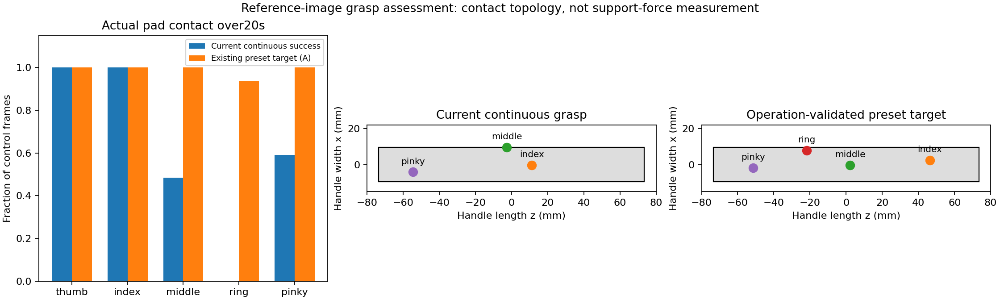
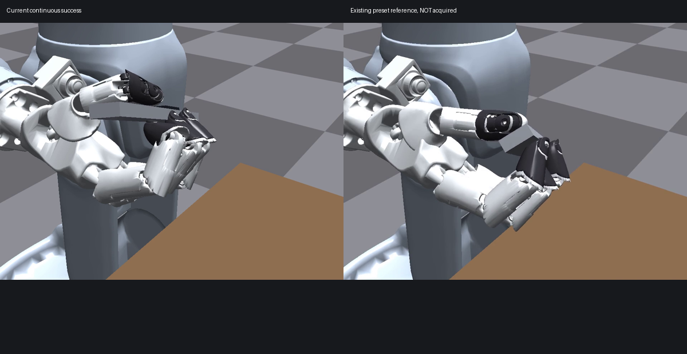

# 参考图驱动的 Wuji 指面支撑目标

用户希望保留已有成功链路和 demo，进一步改进功能性抓姿：刀身横跨非拇指的掌侧指面，由这些手指形成分布式支撑，拇指在上方沿滑块移动。参考图给出了接触布局与手姿偏好；单张图不能确定遮挡接触、关节角、载荷或完整运动能力。

本次仅核查已有实际轨迹并定义新目标参考，**没有新仿真、训练或新的连续成功**。新分支 `feat/g2-wuji-finger-surface-grasp-20260928` 从已发布提交 `ef3f51d066a2526881b6078a4a07a57ce37280ba` 创建，旧分支、权重、物性、原始结果和视频均保留。保护索引见 [preserved-baseline.json](../configs/g2_finger_surface/preserved-baseline.json)。

## 实际支撑关系的差别

对两个已记录操作窗口各600帧进行只读审计。关节顺序由加载物性中的名称和索引恢复；接触统计顺序为 thumb/index/middle/ring/pinky。刀身接触点使用刀身 link_0 本地坐标，滑块点使用 link_1 坐标，不能混为同一坐标。

| 指面接触占操作帧比例 | 当前连续成功 R7-03 | 已有预置参考 R3-15-A |
|---|---:|---:|
| 食指→刀身 | 100% | 100% |
| 中指→刀身 | 48.33% | 100% |
| 无名指→刀身 | 0% | 93.83% |
| 小指→刀身 | 59% | 100% |
| 拇指→滑块 | 100% | 100% |
| 至少3个非拇指同时接触刀身底面 | 43% | 100% |
| 4个非拇指同时接触刀身底面 | 0% | 93.83% |

底面分类使用刀身 y=-4mm 周围0.3mm带，仅作接触位置诊断，不更改仿真碰撞或物理成功门槛。所有统计来自实际接触日志；**接触存在、多个指面接触都不等于测得支撑力或力闭合**。

当前中指的接触中位点约在刀身 x=+9.501mm，即宽度侧边附近；拇指在滑块 x≈-5.000mm，即滑块宽边附近。预置参考的拇指中位点 x=+1.555mm，距近侧宽边约3.445mm，属于滑块表面内部。接触点随运动变化，不能用一个中位点替代整个接触轨迹。



## 有操作证据的第一参考

旧 R3-15-A 在当前 G2 腕部朝向下独立预置，原冻结 teacher 完成两轮：端点误差0.810/0/0.068/0mm，世界漂移4.450mm、旋转0.239632rad。它满足原10mm和2mm端点标准及稳定判据，旋转裕量较小。该证据证明一个较接近指面分布式支撑的终点可以操作；**没有证明桌面取刀与翻掌能连续到达它**。



预置参考的手指仍比用户图片弯曲。它只是第一项有操作证据的对照，不是图像精确重建，也不要求新方案逐关节回到它。没有根据缓存数量虚构其他成功候选。

[operation-target-v1.json](../configs/g2_finger_surface/operation-target-v1.json) 从该 A 试验实际停稳后的第59帧提取 measured q、实际/名义电机目标、T_hand_object、滑块初态及来源哈希。该文件只能用于目标规划或独立预置对照；不能加载进执行中的连续路线。

新目标的优先顺序：

1. 刀身主要由多个非拇指掌侧指面托住，优选四指分担，避免支撑集中在刀边或单个指尖。不把每一帧四指都接触作为预先假定的必要条件。
2. 减少为夹住刀而产生的过度蜷曲，使刀身沿指面形成更连贯的支撑；满足关节限位和实际碰撞约束。
3. 拇指在滑块表面内部获得操作空间，检查整个0/+40mm行程中的触达、限位和接触迁移，不只看闭刀的一帧。
4. 保留刀身抗旋转、刀刃工作区域和滑块运动通道；实际保持与两轮操作评分沿用原标准。
5. 以该接触布局筛选更易连续获取的终点，再规划获取与换握。腕部整体翻转不能替代物体相对手的调整；原点杠杆位移不能解释为刀在掌内所需滑动距离。

原成功获取前缀和局部环境可以复用；现有策略权重是否适应新的手物关系需要独立检查，不能由接触布局相似推断。当前不启动新训练，不自动超过上一轮4组配置额度。目标仍为本机仿真，保留手部无重力、G2伺服和碰撞过滤限制，不宣称真机标定。

## 复现只读核查

```bash
cd /data/research/artgym-g2-finger-surface-20260928
bash scripts/g2_local_python.sh -m scripts.audit_g2_finger_surface_target \
  --continuous-run /data/research/artgym-g2-local-policy-20260928/runs/g2-local-policy-20260928/R7-03-continuous-learned-H-then-joint-S \
  --preset-run /data/research/artgym-g2-tabletop-20260925/runs/g2-overnight-20260926/R3-15-A-functional-current-wrist \
  --output runs/g2-finger-surface-20260928/my-reference-audit \
  --target runs/g2-finger-surface-20260928/my-operation-target.json

firefox http://127.0.0.1:8767/g2-finger-surface-20260928/
```

源码无仿真写入接口。两条来源轨迹及接触文件的SHA256保存在 [contact-comparison.json](g2-finger-surface-20260928/contact-comparison.json)。之前的全量证据仍在原 Release，不重复打包。

下一项唯一优先工作：以指面支撑、适度弯曲和拇指完整行程建立几何可达性筛选，确定值得进行独立保持/操作对照的终点，然后接连续获取。当前已完成的是目标澄清和来源证据核查，不能称新抓姿已经实现。
