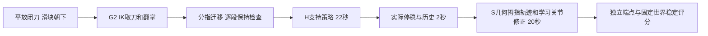

# G2 + Wuji local policy results

**The fixed continuous tabletop task passes (R7-03). Generalization and deployable inputs remain unproven.**
This is a newly learned privileged H→S controller, not the unchanged original teacher or student.
The full uncut 118.967 s run performs normal flat slider-down pickup, approximately 180° air flip,
finger gait, learned 22 s holding, 2 s actual settling/history, then 20 s operation with two cycles.

| Independent fixed-run measurement | Result |
|---|---|
| Four final-0.3 s maximum endpoint errors | 4.145 / 0.001024 / 4.086 / 0.000030 mm |
| Full-operation fixed-world body motion | 2.115 mm / 0.172077 rad |
| Basic endpoint <10 mm AND world <10 mm / 0.25 rad | Pass |
| Strict 2 mm endpoints | Fail on extension |
| Drop / table support during operation | None |
| Thumb–slider contact | All 600 operation frames |
| Independent 22 s preparation H | 0.620 mm / 0.01554 rad; slider movement 0.038 mm |
| Local S repeats from actual H-prepared state | 4/4, one placement; not four geometries |

An independent full fixed-placement repeat R9-03 also passes with identical metrics (2/2 continuous runs, one geometry). Its separate raw audit passes.
The first 2969 continuous frames exactly match the previously successful real H preparation.
The frozen runtime reproduces all 600 operation commands within 1.2e-7 rad and observations within
6e-7. Fifty actual history frames are retained; the new learners are feedforward. The controller
never writes the physical knife/hand state after the initial scene setup, drives the slider,
adds an attachment or applies an external force. Full trace and source audits are in the Release.

## Frozen placement validation completed

The successful pipeline, source pin `8569f43c67817401`, H checkpoint10 and S checkpoint25 were frozen
before declaring20 new placements (seed2026092801; x/y±5mm, yaw±2°), committed as `8c4cce1`.
Manifest SHA256: `9e42be7bee055b3d5d35f6d5e536f573f1ea95547bc931ea8615847562db305c`.
All20 distinct physical placements are complete: **0/20 whole successes, 0 entered operation**.
Therefore conditional S success is **unmeasured**, not0%.

| Stage | Completed /20 |
|---|---:|
| Knife retained at end of lift | 18/20 |
| Free-space flip retained | 16/20 |
| Functional acquisition / policy takeover | 0/20 |
| Complete two-cycle pipeline | 0/20 |

The lift-stage extraction checks the complete120-frame lift and its final30 frames: knife height>0.85m,
no table contact and some hand contact each frame. It is an explicitly described diagnostic extraction;
original acquisition/operation acceptance gates were not changed. Cases04/12 left the knife on the table
before a subsequent flip-IK precheck failed. Two more cases lost retention during the flip. Of the16
retained flips,9 failed gait stability,4 support contact and3 alignment bounds. All failures remain.
Initial placements match the manifest to numerical precision; actual serialized physics matches the
fixed successful run. Planner localization uses known simulation placement, not a real perception system.

There were21 launches: case08 first failed argparse before physics on a negative scientific-notation
`--dy`; one explicitly documented retry used `--dy=<identical value>`, the same immutable source,
weights and all other parameters. The original failed launch/log is preserved. Its physical retry also
failed gait stability. The test contains20 unique geometries, not21.
See [per-placement table](g2-local-policy-validation-v1-stages.csv) and
[complete physical results](g2-local-policy-validation-v1-physical-results.json).

A separate development variant retargets the original **commanded wrist path** by a constant world
transform at the actual gait motor-reference boundary, preserving hand targets, gates and physical state.
At reused placement01 it reduces error enough to pass the former body-drift gate, but the next support
hold fails middle-finger contact (5.935mm/.1893rad body motion still passes). It is not an acquisition
success. On reused placement00 it subsequently passed physical alignment but failed small-finger contact; Round12 below tests that contact. Neither reused case is
new validation. World-transform translation contains a rotation lever arm, not knife slip inside the hand.

## Relevant comparisons

| Comparison | Result and supported inference |
|---|---|
| Original full teacher, actual acquired local S state | 44 mm / 3.131 rad; fails |
| Fixed motor H after same continuous prefix | 0.592 rad rotation; fails |
| Learned H, continuous | 0.01554 rad; passes |
| First learned H output held constant, local | 0.02567 rad; passes; feedback superiority not established |
| H support learner + original teacher thumb S | 0.964 rad; H alone does not transfer to S |
| Geometric thumb prior + fixed learned support | Body passes; 12.39 mm travel then contact loss; extension fails |
| B4 joint PPO selected cp25, old local source | 4/32 development replicas; fresh repeat 0/2 |
| Continuous B4 old source, exact first-observation fix | 44.44 mm / 2.983 rad; quaternion fix alone insufficient |
| Successful command-sequence motor replay | 0/2; command sequence alone fragile |
| Privileged contact-normal / full-point correction | 0/2 each; one full-point run meets endpoints but 11.07 mm / 0.998 rad fails stability |
| Same B4 after physically executed H preparation | 4/4 local repeats and two complete continuous passes |

The H-prepared source is a recorded real continuous state, not an interpolated or cached pose injected
into the continuous task. Compared with the old S source, body pose differs by 0.576 mm / 0.03875 rad
and support motor references by up to 0.01971 rad. This narrows attention to support initialization and
coordination; it does not establish a unique causal mechanism.

## What was trained

Local full-G2 Isaac Gym / GPU PhysX environments restore a documented actually reached state only at
training/evaluation reset. These resets are labeled local, never tabletop success. Two routes and all
four major configurations were used: A1 learned 16-joint holding, A2 learned support with frozen teacher
thumb, A3 corrected an early-termination reward shortcut, B4 learned a bounded 20-joint residual around
a geometric thumb motor path. Reward and independent success scoring are separate.

B4 uses 32 environments, 128×128 MLP/PPO, horizon64, epochs4, minibatch2048, learning rate3e-4,
gamma0.995 and lambda0.95. It completed76 updates /155,776 sampled transitions /1,462 ended training
episodes in2485.67 s including evaluation. Evaluations at10/25/50/75 passed2/4/2/0 of32 replicas;
training was stopped and saved after regression. No fifth major training configuration is started.
Selected checkpoints are A1-H-pilot10 and B4-S-joint-path25. All old models and failures remain.

## Input pipeline and limitations

Actual robot q/qd, command targets, fixed takeover references, external clock and previous policy
outputs join **live simulated knife pose/velocity and slider state** as policy inputs. H adjusts
16 support targets; S adjusts20 targets around the thumb prior. Outputs are robot motor targets only:
residual span±0.20 rad, slew0.60 rad/s, total thumb increment≤0.025 rad/control, original joint limits.
The G2 arm servo and its integral state persist through every stage.

Round8 completed six local diagnostics, with frozen B4cp25 and identical actual H-prepared source:

| Input / physics diagnostic | Complete S passes | Limits of the finding |
|---|---:|---|
| Fixed initial body pose + live slider q/qd | 2/2 | Body1.994/2.141mm, .1199/.1851rad; endpoints<4.4mm; still privileged slider feedback |
| Fixed initial body + slider estimated from robot FK | 1/2 | One passes; one loses slider contact at2.933s and world stability at3.633s; not reliable |
| Original privileged controller, hand gravity ON only | 0/2 | Both first unstable1.033s; same frozen controller is sensitive to omitted hand gravity |

Input variants use one ideal initial object/slider measurement. Their wrist comes from robot FK.
Independent offline replay of actual evaluations matches1200 commands per mode within1.2e-7rad;
poisoning excluded live object/wrist inputs (and slider q/qd in proprio mode) changes commands exactly0.
This confirms the implemented input removal, not deployment readiness. Acquisition and H still use
simulation truth; these are frozen-policy ablations, not a trained student.

The proprioceptive estimate assumes a fixed thumb material point with no slip. On the failed replica,
error reaches30.2mm by3.5s, before the body stability threshold; approximately29.0mm of that comes from
failure of the no-slip material-point assumption and1.14mm from ignored body motion. The successful
replica stays within2.55mm estimate error. The initial reset frame has an empty contact cache; first
contact establishes at1/30s, and it is excluded when identifying loss after establishment. This narrows
the diagnosis but does not prove all proprioceptive estimation impossible.

Gravity changes were verified on exactly26 hand bodies. No other physical parameter changed.
The bounded motor-only gravity-feedforward S comparison R10-01 now independently passes2/2 under hand gravity ON:2.658/2.664mm and .10852/.10636rad; endpoints<3.5mm, strict2mm fails. H comparison independently completes: gravityON without compensation0/2 (.614/.689rad); with the same compensation2/2 (2.431/2.448mm,.02965/.03928rad, slider movement.225/.279mm). The same frozen networks were used, with no new training. Continuous gravityON comparison failed acquisition in both trials: without compensation it failed flip retention; with compensation it retained pickup/flip but exceeded gait rotation at31.767s (8.830mm /0.272567rad). The compensated960-frame motor chain reconstructs exactly, all joint/slew limits hold, and only26hand gravity flags differ from baseline physics. This does not establish gravityON continuous task success. The wrist-frame correction progressed tostep1080, then failed world rotation0.2995rad with middle contact absent. Its first690physical frames match the uncompensated-path variant exactly. The bounded gravity round is closed3/4; the motor bias cap was inactive at the critical gait, so increasing it is not supported by this evidence. Controller:
URDF modeled gravity divided by actual PD stiffness, target bias capped±.08rad, original total target
slew/joint limits retained. Offline torque agrees independent potential-energy derivatives; initial
required bias is≤.06344rad and fits original limits. These are model torques, not measured forces.

Baseline hand gravity is OFF; G2 arm gravity is ON. Original servo, collision filtering, friction,
masses and freely sliding knife joint are unchanged and uncalibrated on hardware. No real detent/lock
force has been measured. These constraints materially limit sim-to-real claims.

## Evidence and continuation

- [Branch](https://github.com/Jr-kelly/artgym/tree/feat/g2-wuji-local-policy-20260928)
- [Release: full continuous and close-up videos, models, raw evidence](https://github.com/Jr-kelly/artgym/releases/tag/g2-wuji-local-policy-20260928-v1)
- [Full successful video](https://github.com/Jr-kelly/artgym/releases/download/g2-wuji-local-policy-20260928-v1/tabletop-pickup-flip-learned-H-S-two-cycles-full.mp4)
- Local browser: http://127.0.0.1:8767/g2-local-policy-20260928/
- [Reproduction commands](g2-local-policy-reproduction-20260928.md), [full preregistration/journal](g2-local-policy-20260928.md), [control ledger](g2-local-policy-control-results-20260928.csv)

R9 gait correction closed: the physical translation passed with0.0838mm tracking error and1.831mm residual position; original orientation alignment then passed with0.01177rad residual. The next failure was missing small-finger support atstep1959. This is progress in acquisition, not a full new-placement success.

The hand-gravity and small-finger comparisons are reported below. No fifth training configuration is authorized within this task budget. Any changed method requires a newly declared test set before a new-placement success claim.

## Matched-state controls and contact adaptation

R13 uses the same actual H-prepared source as the successful local joint policy,
with identical physics, servo,20s clock and independent criteria. Earlier baseline
failures on the original S source remain recorded but are not treated as matched evidence.

| Controller at actual H-prepared source | S success | World stability | What fails |
|---|---:|---:|---|
| B0 original full frozen teacher | 0/2 | 0/2 | Extension endpoint40mm error;24.2–30.6mm drift |
| B1 original frozen teacher thumb, fixed supports | 0/2 | 0/2 | First extension misses; later pose instability |
| Geometric thumb path, zero learned residual | 0/2 | 2/2 | Only11.2–12.7mm travel; extension endpoint40mm error |
| B4 first20-joint network output held constant | 2/2 | 2/2 | Basic10mm passes; strict2mm extension fails |
| B4 dynamic joint policy | 4/4 previously completed | 4/4 | Basic10mm passes; strict2mm extension fails |

The geometric control keeps exactly the learned method's motor mapping and
limits with an identically zero20-joint residual. Model inputs differ across
methods as documented; these controls do not establish a universal necessity
of learning or rule out other planners. In particular, the static-output pair passes with1.235/1.291mm drift and.07343/.07770rad rotation, endpoints<3.18mm. This directly prevents attributing fixed-case Ssuccess to a necessary advantage of online learned feedback. One initial learned motor offset is sufficient in these two local trials; continuous promotion is separately preregistered.

R12-01, on already-seen placement00, adds one-time small-finger landing IK to
R9's wrist-path retargeting and physical alignment. It preserves the original
knife-relative contact point and1.15mm nominal closing displacement. Only four
small-finger targets change (maximum0.02064rad), after geometric collision checks.
The preceding1839physical frames exactly match the failed R9-04 run.

Small-finger support now passes its1s hold (2.048mm/.01613rad,100% contact),
then thumb release and slider contact also pass. However learned H22s fails
rotation (.324005rad,1.885mm), and S fails40.329mm/2.82632rad; all four endpoint
windows fail. There is no whole-task success on this development placement.
Independent motor/input replay matches600S commands within1.2e-7rad; initial
quaternion comparisons show no hemisphere flip. This narrows the issue to
transfer from the changed acquired grasp rather than establishing a unique cause.
R12-02 repeats the modified small-finger method at the old nominal placement and passes the full task:2.097mm/.179235rad, endpoint maxima4.346/0/4.286/0mm, H0.619mm/.01307rad. This is a regression check of the changed method, not unseen-placement validation.

R12-03 reuses exactly the seen00 acquisition and holds actual motor targets for22s instead of learned H. H fails2.603mm/.561397rad, versus learned H1.885mm/.324005rad. Both fail; this does not show that the new grasp is stable if learning is removed. The prespecified conditional static-S trial is therefore not eligible. Its S stage also fails:35.516mm/2.52290rad, first instability3.167s; all four endpoint windows fail. The independent audit proves2309identical pre-H physical frames and600matching S motor commands. Original-nominal continuous static-S subsequently passed, as detailed below.

Read-only contact timing shows the middle finger loses contact for at least0.3s starting6.667s under learned H and3.2s under fixed H; world rotation first exceeds its limit at8.667s and3.333s respectively. Nominal learned H maintains middle contact99.85% of frames with no sustained loss. World and hand-relative error agree because the wrist is stationary. These observations localize a support difference, but contact occurrence is not measured load and does not establish a unique cause.

## Continuous single-inference control completed

R14-01 keeps exactly the original2,969physical acquisition/H/history frames,
then replaces dynamic S inference with one initial20-joint network output,
held fixed while the clock-driven geometric thumb trajectory continues.
The independent audit verifies one model call, constant normalized output,
and exact replay of all600motor commands. No later robot/object/slider input
is read by this S controller; actual motor servos and state/history logging continue.

The complete118.967s run passes: body1.671mm /0.226193rad; four endpoint
maxima2.915 /0 /3.387 /0.000007mm; slider travel37.288mm. There is no drop,
table support, state reset, object constraint, external force or slider drive.
Strict2mm extension still fails. Its rotation is closer to the0.25rad limit than
the original dynamic S run, so this does not establish superior robustness.

This is one complete trial at the original placement, plus the two earlier
local static-output trials. It is not an additional repeat of the original dynamic
method, nor a new placement. It confirms that continuous online S-network feedback
is unnecessary in this tested fixed scene. Ideal initial measurement and privileged
acquisition/H remain; no trained/deployable student claim is made.
The conditional seen00 static-S trial was not launched because its fixed-H
prerequisite failed. The original frozen20-placement validation remains0/20.

[Single-inference full video](https://github.com/Jr-kelly/artgym/releases/download/g2-wuji-local-policy-20260928-v1/tabletop-initial-learned-offset-two-cycles-full.mp4)
· [Same-run closeup](https://github.com/Jr-kelly/artgym/releases/download/g2-wuji-local-policy-20260928-v1/tabletop-initial-learned-offset-two-cycles-closeup.webm)
· [Matched holding/contact diagnostic](https://github.com/Jr-kelly/artgym/releases/download/g2-wuji-local-policy-20260928-v1/continuous-hold-support-comparison-R12.png).

## 当前判断与方法链路

固定摆放的连续任务已经成立：正常平放取刀、空中翻掌、分指换握、22秒学习保持、2秒实际停稳，随后20秒两轮伸缩。它使用本轮实际训练的新策略，不能记作原teacher或student成功。严格2mm端点标准尚未通过。

获取阶段使用仿真定位和接触检查；H、动态S使用关节、本体状态和物体真值。所有执行输出是机器人电机目标。局部环境只在回合开始从实际轨迹重置；完整连续路线从桌面起始执行，不注入局部状态。操作阶段采用固定外部时钟，滑块行程由接触产生。

证据支持的边界：

- 稳定持刀和两轮伸缩都在一个实际可达抓姿成立；同一摆放重复成功不等于泛化。
- 公平初态对照中，原teacher、仅拇指teacher和零残差几何轨迹均失败；固定第一次学习输出也成功。因此这组消融支持学到的关节修正有用，尚未证明持续反馈必不可少，也没有排除其他规划方法。
- 20个新摆放全部在取得功能抓姿之前失败。后续已见样本上的腕轨迹与小指接触修正让换握前进，但22秒保持仍失败。瓶颈更集中在获取末态的支撑分布和控制迁移；不能据此认定唯一根因或宣称必须使用RL。
- 去除实时物体信息的局部诊断、手部重力对照都已运行；整套系统仍非可部署student。真实刀具锁止/阻力、碰撞和伺服尚未标定。
- 下一项优先投入应是把已实际达到、但保持失败的变化抓姿纳入支持控制任务，保留名义抓姿回归对照，先验证22秒保持再扩展伸缩。它需要另行分配训练配置；本轮4组训练配置预算已用完，不追加第五组或大规模抓取RL。

## 本轮收尾

本轮在本机RTX4090实际完成4组主要训练配置、72/80次控制开发执行，以及另外20个冻结新摆放验证（含一次物理开始前CLI错误的保留重试，共21次启动）。所有开发执行已终结，没有本轮训练或仿真留在后台；原检查任务和视频服务器保留。

学习、调试记账2.106 GPU小时；把全部仿真/评测也计入、合并同一GPU上重叠区间后，保守记账4.800 GPU小时，低于12小时上限。保留未使用的试验额度，不为凑预算追加试验。固定任务、强对照、摆放验证及主要迁移风险诊断均已完成；泛化和可部署输入未解决。后续训练要先为多实际获取末态的支持任务分配新配置，不把本轮剩余GPU时间当作第五配置授权。
