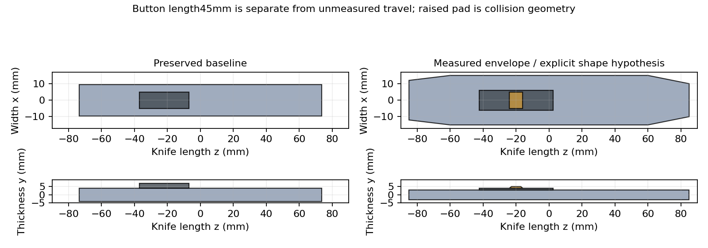
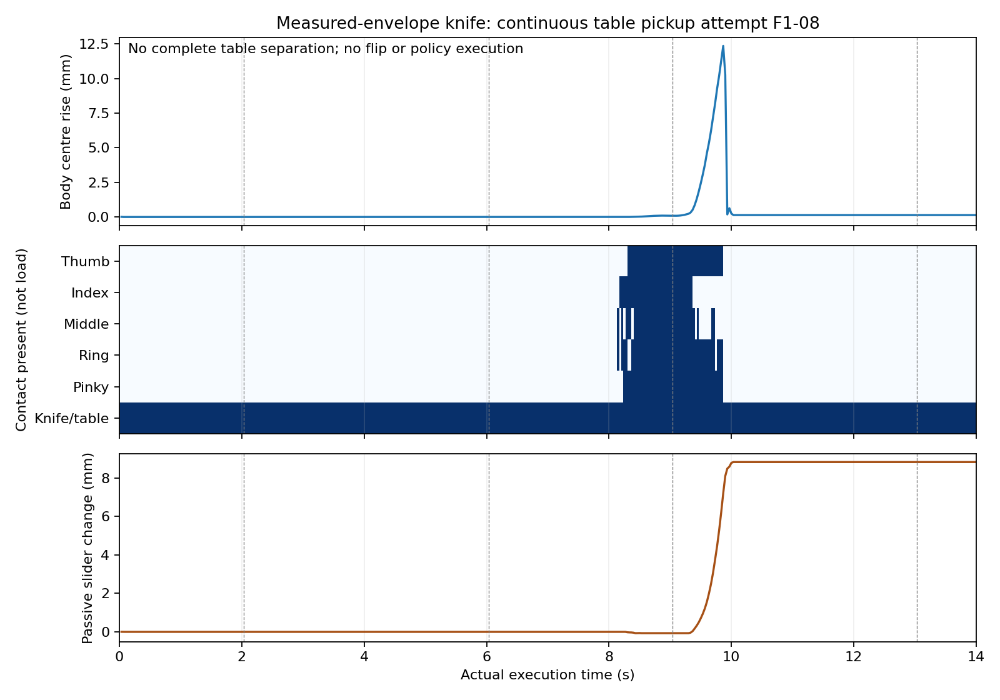

# 实测尺寸美工刀：资产与连续取刀验证（2026-09-28）

**新资产已建模、接入 Isaac Gym 并实际执行；功能性抓取尚未成功。** 原成功资产、配置、权重与 demo 保留。两次新资产开发执行中，一次在接近前被净空检查拒绝；另一次实际闭合并起抬，但刀未完全离桌。未进入翻掌、拇指转移、teacher 或 student。

[独立分支](https://github.com/Jr-kelly/artgym/tree/feat/g2-wuji-finger-surface-grasp-20260928) · [视频和原始证据 Release](https://github.com/Jr-kelly/artgym/releases/tag/g2-wuji-finger-surface-20260928-v1) · [旧成功版本（不覆盖）](https://github.com/Jr-kelly/artgym/releases/tag/g2-wuji-local-policy-20260928-v1)

## 测量与假设分开

新资产：`assets/objects/knife_wuji_measured_envelope_20260928_v1/000/`；输入参数：`configs/g2_finger_surface/measured-knife-v1.json`。生成器拒绝覆盖已有目录；加载器逐项校验 URDF/网格 SHA256。

| 项目 | 原资产 | 新 v1 | 来源 |
|---|---:|---:|---|
| 整体长 / 最大宽 |147 / 19 mm|170 / 30 mm|新值为用户约测值，轮廓未知|
| 整体厚 |11 mm：刀身8＋按钮3|8 mm|用户约测；是否包含凸起未知|
| 按钮本体沿刀长尺寸 |30 mm|45 mm|用户约测；不是滑动行程|
| 刀身 / 按钮基座 / 凸起厚 |8 / 3 / 0 mm|6 / 1 / 1 mm|仅为“8 mm 包含凸起”的主假设|
| 按钮宽 |10 mm|12 mm|未测假设|
| 凸起宽×长×高 |无|10×8×1 mm|未测假设；顶部宽/长比例0.7，可调|
| 收回按钮中心 z |约−22.05 mm|−20 mm|未测假设|
| 全行程 / 操作幅度 |50 / 40 mm|50 / 40 mm|仅继承对照值，均未测|

刀柄采用两端收窄的凸多面体，宽度沿长轴为24→30→30→20 mm；170×30是最大包络，不是把整个刀柄当170×30×8长方体。按钮与凸起是被动滑块上的两个独立碰撞组件。没有虚构锁止机构或由尺寸推断推动阻力，也未展开刀片切割/精细外观建模。

当前主假设下，闭合三组件包络核验为 **170×30×8 mm**，按钮长45 mm、关节行程50 mm分别读取核验。`thickness_measurement_interpretation`默认`closed_assembly_includes_bump`；若补测确认8 mm不含凸起，需用`closed_assembly_excludes_bump`另建版本并重新分配尺寸，不能修改正在使用的v1。



质量仍为29g＋6g，刀具摩擦3、滑块阻尼0.3/关节摩擦0.001均保留原仿真假设，未做真机标定。G2原伺服10/20/积分1、手部无重力及原碰撞过滤限制保持。既有加载器重算质心和惯量，所以新几何不是纯外观变化；各次`physics.json`记录实际惯量、质量、3个载入碰撞形状及其属性。`effective-configuration.json`明确几何覆盖，`frozen-config.yaml`只是继承的控制配置。

## 哪些旧抓姿和策略需要重新验证

- 把旧预置操作的**实际**关节及手物关系放到新几何下，四根非拇指到刀身有约0.917–1.000 mm正分离间隙，拇指到滑块约2.633 mm。没有穿透不等于仍然支撑。
- 在这个旧参考上对假设0–50 mm行程做26点顺序拇指IK：标记点误差都小于0.370 mm，但完整指腹与刀身/按钮相交，而且关节到限位。这条名义路径不能直接执行；不代表所有拇指接触方式都不可行。
- 原student初始化硬编码旧六项几何尺寸；当前运行器因此只允许新刀做获取诊断。未宣称新刀可直接复用冻结策略，更没有自动增加训练配置。
- 拇指释放后四指保持、拇指覆盖实际行程、凸起上的真实操作稳定性，**均尚未完成物理验证**。

## 实际试验及失败定位

| 执行 | 结果 | 可支持的结论 |
|---|---|---|
| F1-07，pin `9d2343a27f1c2fe4` |自然落稳2秒后，计划手桌间隙最小0.0416 mm，低于原0.5 mm；接近前停止|模型可加载，凸起朝下的实际落稳姿态必须重查；不是一次实际抓取失败|
| F1-08，pin `0cc7584737f0d607` |用F1-07实际记录离线重规划，再从原桌面初态完整执行；实际净空0.5384 mm通过。闭合形成五指接触，起抬失去接触，1秒保持失败|修正了规划/实际落稳接口，但尚未建立可抬起的侧夹保持|

F1-07末1秒刀身平移变化小于0.18µm、角度变化小于1.58e−6rad，已充分落稳。F1-08前60帧刀身位置/姿态与F1-07完全相同；没有把这个记录载入物理状态。改进仅为离线规划使用实测姿态和被动滑块位置，并避免将实测根部高度重新替换为理想几何高度。

F1-08共420控制帧/14秒，刀身中心最高比落稳位置上升 **12.35 mm**，但**所有帧仍有刀桌接触，不能称已取起**。约9.9秒（起抬约0.9秒）全部手刀接触丢失，手内位置偏差越过10 mm；未执行翻掌。滑块被动变化约8.9 mm，不是策略伸缩。末段刀静止在桌面，局部漂移小，仍因高度/刀桌接触/无指接触而保持失败。

闭合末帧拇指、食指接触已接近假设6 mm刀壳的上边缘（局部y约−3 mm）；起抬中接触消失。闭合末最大关节位置与电机目标差约0.039 rad，腕部位置误差约0.243 mm；这些是位置差，**不是实测夹持力**。接近/闭合时中指另有10/11帧桌面接触，说明几何电机路径净空不能替代真实伺服/碰撞检查。现有对照不足以认定边缘接触、驱动响应或物性是唯一原因。



新资产实际抓取尝试0/1通过；另一次在接近前被拒绝。两次开发启动均未完成整段，不能当作泛化统计。条件伸缩成功率无样本，teacher/student均未进入。操作阶段10mm/2mm及漂移标准未放宽，也未用刀在桌面静止冒充稳定持刀。

CPU另外检查的3条180°翻掌路径（刀长轴正/反转、腕前向轴正转）均在当前G2关节分支到限位而失败，未在物理中执行。静态碰撞、握持和可操作性分别记录，不混为成功。

## 保留、预算与下一项

F1-01至F1-06属于旧刀尺寸，结果独立保留；F1-06运行中未换资产。旧刀URDF SHA256仍为`5229c66b183cc6da04190bf2d6cfbd035fadd227340dc8f26602b207171b461c`，保护的H/S权重逐项哈希也未变。没有过程物体状态写入、吸附、隐藏外力或滑块驱动。

继承的开发预算已 **80/80** 次，主要训练配置 **4/4**；本分支没有新增训练。含已有工作与本分支全部仿真/渲染的保守单GPU计时约4.957小时。无活动任务仿真/训练。目标未完成，停止新增物理试验，不自动扩大RL或申请第81次。

下一项唯一优先：在另有开发额度后，针对薄刀上缘接触，做**侧夹接触迁移＋短抬保持的有界对照**，先区分未建立稳定侧夹与起抬中接触迁移失效，再扩展翻掌。现有证据不支持“RL必不可少”或“只要增大摩擦/增益就行”。

补测后必须重查：8 mm是否含按钮凸起、实际刀柄厚度/轮廓；按钮宽和凸起高度/轮廓；实际行程及完全收回位置。质量、阻力、摩擦和锁止另行测量，当前不能从外形推断。

## 复现及交付

完整运行命令和来源在 [复现说明](g2-finger-surface-reproduction-20260928.md)；Release增量03包含F1-06/07/08轨迹、实际接触、逐次失败、全部新增几何拒绝、命令/源码pin和新资产。视频是每次从桌面初态开始的完整无字录制，WebM只是兼容Firefox的编码转换，没有拼接。

```bash
cd /data/research/artgym-g2-finger-surface-20260928
# 新输出目录；不覆盖正在使用的资产
bash scripts/g2_local_python.sh -m scripts.build_g2_measured_knife \
  --spec configs/g2_finger_surface/measured-knife-v1.json \
  --output assets/objects/knife_wuji_measured_envelope_replay/000
# 对真实轨迹重新评分，不新增物理试验
bash scripts/g2_local_python.sh -m scripts.summarize_g2_finger_surface \
  --run runs/g2-finger-surface-20260928/F1-08-measured-recorded-rest-pickup \
  --output runs/g2-finger-surface-20260928/my-measured-audit.json
firefox http://127.0.0.1:8767/g2-finger-surface-20260928/
```
