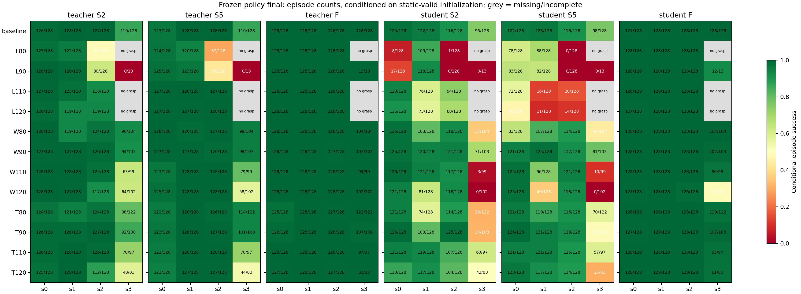
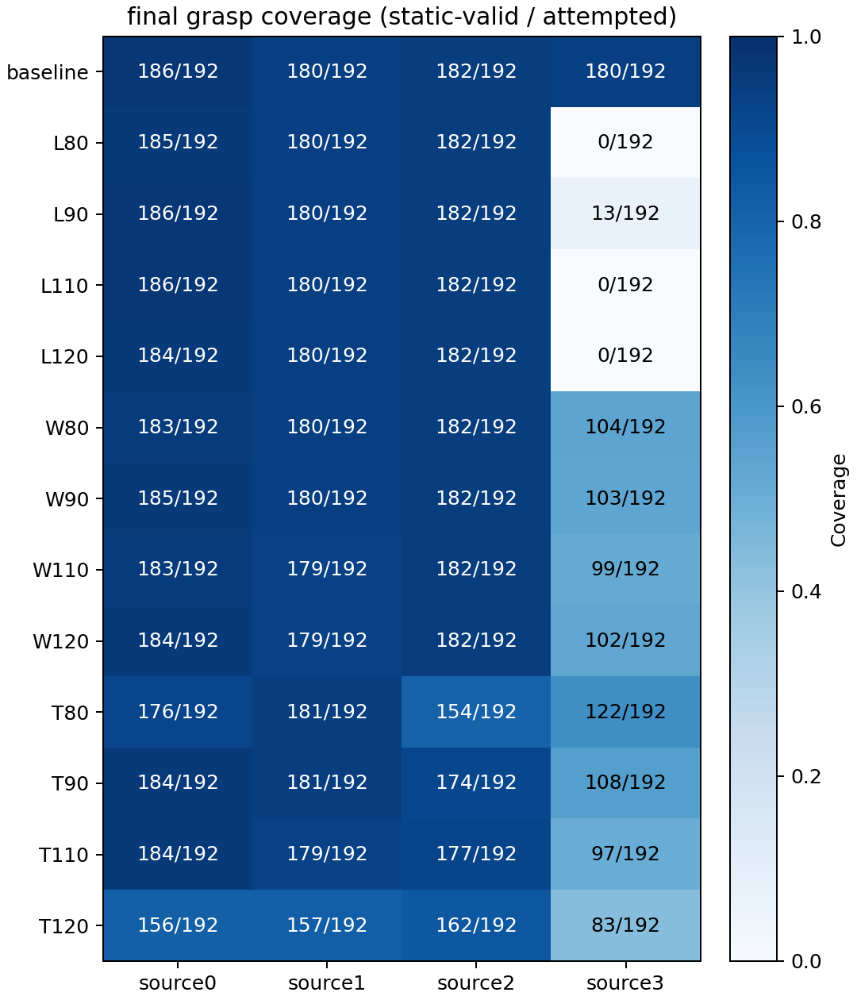
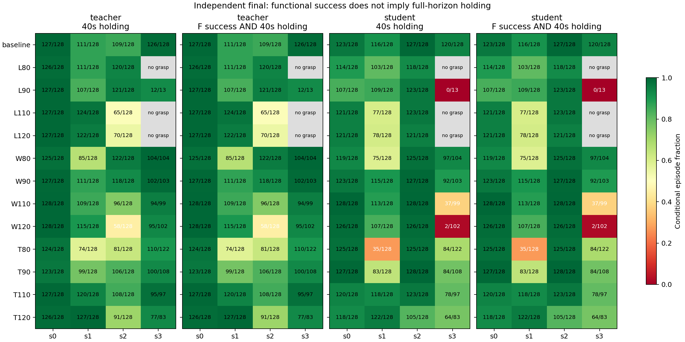
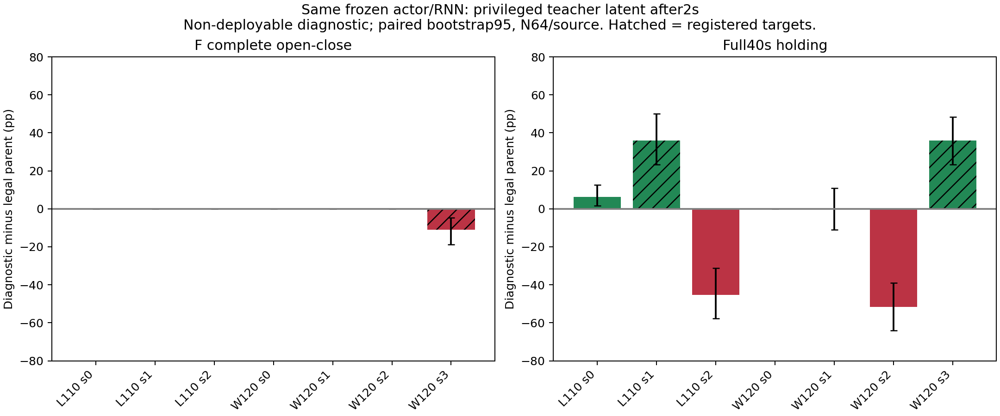

# Wuji 美工刀尺寸泛化：最终报告

本轮保留原冻结 teacher 与 SA51200，完成13个单轴尺寸的筛查、9个关键条件的独立确认，以及全部13条件的独立最终评测。E→C 的有特权 learner-state 诊断未通过预登记续训前提，因此没有训练新模型，也没有宣称模型提升。最终集只在父模型、抓姿配方、评分和源码哈希冻结后打开，未用于重选或回训。

## 能力范围与覆盖

刀柄基线 L147/W19/T8 mm。测试点为单轴0.8、0.9、1.1、1.2倍：L117.6–176.4、W15.2–22.8、T6.4–9.6 mm，其余轴保持基线。它们是离散受控仿真点，不能解释为连续区间、真实刀具类别或组合尺寸的已验证泛化。质量与有效惯量固定，滑块尺寸/50mm关节行程/控制物理不变；操作目标伸出40mm。厚度变化仅作必要的导轨表面Y移动。

下表为最终F的各来源计数，格式“完整开合 / 全40秒持握稳定 / 分母”。功能成功可以与全程持握失败同时发生。缺抓姿不能记作操作0%；不足128有效状态的来源保留实际分母。完整S2/S5、Wilson95、配对四格与连续指标见 [FINAL_TABLES.md](FINAL_TABLES.md)、[final-analysis/report.json](final-analysis/report.json) 和 [episodes.csv](final-analysis/episodes.csv)。

|尺寸条件|L/W/T mm|模型|来源0|来源1|来源2|来源3|
|---|---|---|---|---|---|---|
|baseline|147/19/8|teacher|128 / 127 / 128|128 / 111 / 128|128 / 109 / 128|128 / 126 / 128|
|baseline|147/19/8|student|127 / 123 / 128|128 / 116 / 128|128 / 127 / 128|128 / 120 / 128|
|L80|117.6/19/8|teacher|128 / 126 / 128|128 / 111 / 128|128 / 120 / 128|无有效抓姿|
|L80|117.6/19/8|student|128 / 114 / 128|128 / 103 / 128|128 / 118 / 128|无有效抓姿|
|L90|132.3/19/8|teacher|128 / 127 / 128|128 / 107 / 128|128 / 121 / 128|13 / 12 / 13|
|L90|132.3/19/8|student|128 / 107 / 128|128 / 109 / 128|128 / 123 / 128|12 / 0 / 13|
|L110|161.7/19/8|teacher|128 / 127 / 128|128 / 124 / 128|128 / 65 / 128|无有效抓姿|
|L110|161.7/19/8|student|128 / 121 / 128|128 / 77 / 128|128 / 123 / 128|无有效抓姿|
|L120|176.4/19/8|teacher|128 / 127 / 128|128 / 122 / 128|128 / 70 / 128|无有效抓姿|
|L120|176.4/19/8|student|127 / 121 / 128|128 / 78 / 128|128 / 121 / 128|无有效抓姿|
|W80|147/15.2/8|teacher|128 / 125 / 128|128 / 85 / 128|128 / 122 / 128|104 / 104 / 104|
|W80|147/15.2/8|student|128 / 119 / 128|128 / 75 / 128|128 / 125 / 128|104 / 97 / 104|
|W90|147/17.1/8|teacher|128 / 127 / 128|128 / 111 / 128|127 / 118 / 128|103 / 102 / 103|
|W90|147/17.1/8|student|128 / 123 / 128|128 / 115 / 128|128 / 127 / 128|102 / 92 / 103|
|W110|147/20.9/8|teacher|128 / 128 / 128|128 / 109 / 128|128 / 96 / 128|99 / 94 / 99|
|W110|147/20.9/8|student|128 / 128 / 128|128 / 113 / 128|128 / 128 / 128|96 / 37 / 99|
|W120|147/22.8/8|teacher|128 / 128 / 128|128 / 115 / 128|128 / 58 / 128|102 / 95 / 102|
|W120|147/22.8/8|student|127 / 126 / 128|128 / 107 / 128|126 / 126 / 128|50 / 2 / 102|
|T80|147/19/6.4|teacher|125 / 124 / 128|128 / 74 / 128|127 / 81 / 128|122 / 110 / 122|
|T80|147/19/6.4|student|128 / 125 / 128|128 / 35 / 128|128 / 125 / 128|119 / 84 / 122|
|T90|147/19/7.2|teacher|126 / 123 / 128|128 / 99 / 128|128 / 106 / 128|107 / 100 / 108|
|T90|147/19/7.2|student|127 / 127 / 128|128 / 83 / 128|128 / 128 / 128|107 / 84 / 108|
|T110|147/19/8.8|teacher|128 / 127 / 128|128 / 120 / 128|128 / 108 / 128|97 / 95 / 97|
|T110|147/19/8.8|student|128 / 120 / 128|128 / 118 / 128|128 / 123 / 128|95 / 78 / 97|
|T120|147/19/9.6|teacher|127 / 126 / 128|128 / 127 / 128|127 / 91 / 128|83 / 77 / 83|
|T120|147/19/9.6|student|128 / 118 / 128|128 / 122 / 128|128 / 105 / 128|81 / 64 / 83|

几何等权、来源等权的汇总仅描述这13个测试点的已覆盖来源，不混合所有episode掩盖边界，也不把缺失来源当作已覆盖。每个来源的初态属于既有三个基础抓姿簇附近的小扰动；0/1邻近，四来源不是四种刀具。跨几何适配后物理初态不同，保留扰动lineage；每个几何内teacher/student使用同一有效状态文件。多个协议重复使用同一初态，不是新增独立抓姿样本。连续误差的mean/max使用active帧；辅助worst_stage_tail_mean_error_m在截断轨迹中可含partial/inactive窗口，不能当作完整阶段精度，主严格评分并不使用该辅助列。宏平均不外推总体或提供总体尺寸分布认证。

- student F：已覆盖来源的几何等权成功率 98.55%，全程持握 83.24%，成功且全程稳定 83.24%。
- student S2：已覆盖来源的几何等权成功率 69.20%，全程持握 91.08%，成功且全程稳定 69.20%。
- student S5：已覆盖来源的几何等权成功率 63.78%，全程持握 91.76%，成功且全程稳定 63.78%。
- teacher F：已覆盖来源的几何等权成功率 99.85%，全程持握 88.20%，成功且全程稳定 88.20%。
- teacher S2：已覆盖来源的几何等权成功率 89.96%，全程持握 98.29%，成功且全程稳定 89.96%。
- teacher S5：已覆盖来源的几何等权成功率 90.62%，全程持握 98.90%，成功且全程稳定 90.62%。

teacher 在每个**已覆盖**来源F≥80%的离散条件：baseline, L80, L90, L110, L120, W80, W90, W110, W120, T80, T90, T110, T120。这只是功能探索参考；全程稳定性、低样本来源及缺口仍必须同时查看。

student 在每个**已覆盖**来源F≥80%的离散条件：baseline, L80, L90, L110, L120, W80, W90, W110, T80, T90, T110, T120。这只是功能探索参考；全程稳定性、低样本来源及缺口仍必须同时查看。

## 限制与干预判断

限制是混合的。长度变化的来源3有静态适配覆盖缺口：局部端部接触目标裁剪会引出小指穿透代理超限，但不能据此断言物理不可行。W120来源3则存在有效初态下的真实student功能与持握退化；L110来源1主要是全程持握差距；一些来源2条件的teacher反而不如student。严格S端点失败、至少一次开合失败与刀身持握失稳分开报告，不能把S不通过全部解释成无操作能力。

独立64样本确认：W120来源3原teacher完整开合64/64、持握55/64；SA为33/64、2/64。L110来源1双方完整开合64/64，持握teacher58/64、SA33/64。来源2上SA保持优势：L110持握61/64 vs teacher31/64，W120持握64/64 vs teacher28/64。

同一learner actor和实际incoming RNN先执行2秒合法SA，然后以原teacher真实特权latent替换student latent。前60步action/slider差值均为0，goal完全相同；模型/normalizer哈希不变。这是**不可部署的特权诊断**，不是student新增能力。L110来源1持握33→56/64，配对提高35.94pp [95% 23.44,50.00]，功能64/64不变。W120来源3持握2→25/64，但功能33→26/64，配对−10.94pp [−18.75,−4.69]。后者不满足已登记“持握提升≥15pp、配对下界>0且功能不明显回退”前提。来源2持握也分别61→32/64、64→31/64。

据此停止C分支，不改学习率/损失/网络，不为用满预算继续训练。诊断说明部分learner状态上teacher latent能改善持握，但未证明其监督可在目标失败区域同时保持功能；没有证明student能从合法观测推断该latent，也没有排除早期不可恢复偏移、历史/RNN与状态分布问题。没有开展B或并行A训练/修复。本轮没有优化随机流、没有新checkpoint、没有同预算续训对照；这些训练条件未触发，不能声称新模型超过父模型。也没有跨尺寸训练，因此未触发训练后的未见组合几何最终验证条件。

逐episode诊断复算见 [intervention-analysis/episodes.csv](intervention-analysis/episodes.csv)。斜纹是预登记目标，来源2的持握退化保留。

## 下一轮唯一优先动作

优先做**局部功能抓姿适配修复**：保持现有抓取框架，用新开发数据检验长度来源3端部支撑目标和W120来源3支撑保持是否可改善；保留原配方对照，再测同一冻结teacher/student。长度缺口是明确覆盖问题，宽刀在有效初态中仍失败且当前teacher干预不能同时救回功能，直接追加蒸馏缺少本轮要求的依据。W120失败是否由支撑配方主导仍是待验证假设，不能作为已证明根因。

## 离线接口与现实边界

已实现独立reset/step，维护50步history、previous action、issued target与RNN，使用测得q和FK以及初始化标定的刀身/滑块位姿、bbox；外部目标生成器单独保留。CPU原player非恒定80步、4槽、两次部分reset对比通过：action最大1.14e-5、target4.77e-7rad、RNN1.51e-4。实际H200输入→CPU累计回放未过容差：action0.004527、target0.000113rad、RNN0.060784；记录incoming RNN/完全相同网络输入的单步诊断仍有差异，支持设备/后端数值差异解释，但没有直接证明TF32贡献。负结果保留，不能称跨设备完全一致。

S2/S5由固定外部2/5秒时钟换向。F沿用仿真slider真值到位触发（<10mm持续45步），不能证明无传感器自主到位。初始标定与几何已知是条件；本轮不解决自主抓取、翻转、纸张裁剪或真机感知。没有驱动机器人，不能宣称sim2real。最少仍需测量真实刀柄/滑块/关节行程、相对初始位姿、关节顺序/零位/实发目标、滑动阻力与手接触/控制响应；本轮固定惯量与阻力不是这些实测参数。

## 证据、复现与消耗

源码/受控资产/静态初始化、冻结H200筛查、独立确认/最终、特权诊断、CPU接口验证、RTX4090视频重新仿真和真机结果是不同类别。视频来自单独RTX4090摄像重新仿真，不能替代H200统计；基线、小刀、大刀及已确认W120边界均有teacher/student同初态并排，失败保留。没有真机结果。

[REPRODUCE.md](REPRODUCE.md) 给出最短恢复和直接运行命令；大文件在独立Release `wuji-geometry-generalization-20261002-v1`，旧Release保持原样。源码pins按每个实际作业取证，不用后续源码冒充早期版本。模型包保留原Adam/RNG，可恢复下一步51201；CPU审计在独立内存副本上执行合成梯度更新以验证一致性，未对研究候选或checkpoint文件执行续训更新。GitHub实际下载、哈希、恢复与评测命令验证见交付核验文件。

预算快照（以STATE记录时间和最终交付核算为准）：历史 32.45340539 GPUh，本轮已完成 7.93792703 GPUh，累计 40.39133242 GPUh，剩余 23.60866758 GPUh。计费为每个实际GPU作业分配墙钟，包括准备/必要渲染/恢复验证；利用率时间积分不是额外GPU消耗。

最终分母：5951个新静态有效初态分别在两个模型、三个协议中复用，共35706条protocol episode记录；不是35706个独立初始化样本。W120来源3：SA完整开合50/102（Wilson95 39.53–58.58%）、40秒持握2/102；同初态teacher102/102、95/102。全部统计与完整覆盖计数见FINAL_TABLES/JSON。
