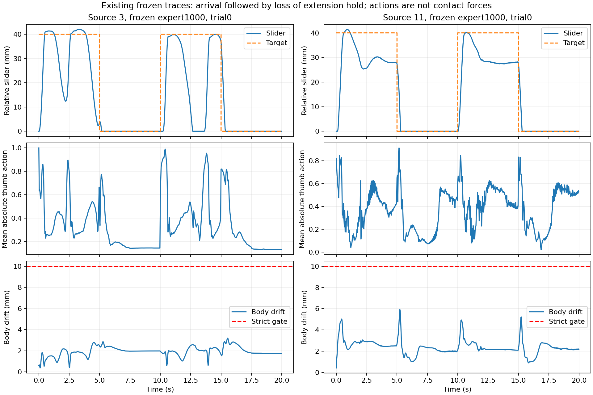

# Wuji 源3/11端点保持：受控续训（运行中）

本轮在独立分支 `feat/wuji-hold-controlled-20260929` 实际执行。上一轮最终提交 `f332e4e` 及所有成功版本、权重、视频保留。训练于2026-09-29 06:40UTC启动，当前尚无新策略冻结结果，不把启动训练写成改善成立。总预算06:08:43—18:08:43UTC，至少最后一小时留冻结评估与交付。

## 先纠正奖励日程解释

上一轮奖励日程的 ObjPosDeviation、ObjRotDeviation、StableContact 起点/终点分别都为 -0.5/-0.02/0；绝对位姿惩罚 coefficient=1、ramp_epochs=0。进度44.4%不会改变这几项权重，不能解释为稳定约束未充分生效。本轮续训是控制组，用于隔离继续优化的效果，不以“补完日程”认定会改善。证据 `receipts/curriculum-correction.json`。

## 已有时序诊断

不新增仿真，复查上一轮两个专家final1000、各32扰动的2/5秒原始时序。全部曾到位与保持到阶段末是不同指标；严格成功仍要求全20秒刀身稳定、存活及每阶段末0.3秒误差<2mm。

|源/协议|伸出阶段曾到位0.3秒|伸出阶段末保持|收回阶段末保持|
|---|---:|---:|---:|
|3/2秒|156/160|86/160|159/160|
|3/5秒|61/64|22/64|62/64|
|11/2秒|153/160|6/160|160/160|
|11/5秒|64/64|0/64|63/64|

主要观测是伸出后回缩，失败端点刀身仍稳定，拇指接触代理多半仍在；不能由相关时序证明奖励、接触或动作接口是根因。源11在5秒失败伸出端平均有符号误差约-12.88mm。目标按每次初始slider加0.04/0米交替，不是固定全局0.04/0；初版离线绝对阈值标签错误已保留为invalid并修正，物理与严格评分未改变。

完整逐阶段CSV、按端点分组及源码/权重哈希见 `diagnosis/`。图取每源第0回合，不挑最佳或最坏。接触是净力二值代理，动作幅度不是接触力。

## 正在执行的最小对照

每个来源从同一个原专家CP1000做两组完整状态续训，模型/归一化器/优化器/计数器均恢复；checkpoint没有PhysX状态，因此两组都用新成对seed重置rollout及RNN，不冒充逐位连续仿真。

|来源|控制组|改动组|每组新增交互|
|---|---|---|---:|
|3|原奖励 GoalDistance2=0.1|GoalDistance2=1.0|163840000|
|11|原奖励 GoalDistance2=0.1|GoalDistance2=1.0|163840000|

只提高已有的持续定位项 `exp(-(slider_error/0.002)^2)` 系数；不新增奖励公式、不改Success=50、不改定时目标、不改动作范围/物理/网络/严格标准。现有Success每命令到位保持0.3秒后只发一次，持续定位项在整个命令期间计算；新旧差值上限每步0.9。假设是持续误差反馈可能改善到达后的保持，对照检验其充分性而非预设根因。

每组5120环境、32步rollout、追加1000轮至总CP2000、seed2026092901、span0.04、thumbstep0.025。10轮预检每轮10.6—10.9秒，通过后锁定预算。源内模型、优化器和学习率摘要完全相同；两源原学习率不同但源内匹配。正式命令仅实验名和GoalDistance2权重不同，91个运行源码SHA已保存。预检权重不用于正式起点。

## 冻结评估和选择

主表固定最终CP2000，按相同新增交互比较。另以开发每源32固定扰动、CP1250/1500/1750/2000严格2/5秒等权平均选择，平局取最新；选点表单列，不替代同预算主表。最终每源128新扰动在评估前生成冻结，开发和最终在同一来源用不同随机种子。每源父专家/两条件/选择权重都在同一GPU、同一初态评估；完全相同权重可重用同协议证据并明确标注，不冒充新物理回合。

严格2/5秒：20秒固定时钟，阶段末9控制步误差<2mm，全程alive、刀身平移<10mm及旋转<0.25rad。宽松协议10mm到位换向至少3完整轮，单独记分，不等同严格保持。静态基线单列，既报告全体也报告静态可保持子集。新扰动属于已训练基础抓姿附近验证，绝不是未见基础抓姿或真机泛化；硬限位/端点表现不替代任意内部位置精度。

尚未执行独立续训种子和单一多抓姿整合；待核心改善证据再决定，不能提前承诺有效。原3抓姿的开发/最终扰动只为条件整合预留，不参与本轮源3/11选点。

## 复现与资源

- 入口 `scripts.launch_wuji_hold_arm.py --row 3 --condition original --gpu 0 --additional-epochs 1000 --name NEW_RUN`（使用同一IsaacGym环境）；改动组condition=`dense1`。
- 执行/恢复身份 `scripts.train_wuji_hold.py`；GPU租约及有界看护 `scripts.run_wuji_hold_job.py`；开发/冻结入口 `scripts.evaluate_wuji_hold.py`；独立复算 `scripts.analyze_wuji_hold.py`。
- 父权重SHA、初始化摘要、数据SHA、运行命令见 `receipts/` 与 `data/manifest.json`；预注册 `preregistration.json`；持续交接 `WUJI_HOLD_HANDOFF.md`。
- 新主机10.14.0.107:30296，06:12UTC实测4张H100空闲后使用；未终止其它任务。各卡只有有用训练/评估；利用率和实际PID均带时间，见 `receipts/gpu-history.jsonl`、`monitor-latest.json`。
- 用户命名的附件 `Codex-Goal-Wuji-Hold-20260929.md` 暂未在可见下载/tmp/research找到，已请求路径；当前执行依据是本轮用户消息的明确要求，未声称读过缺失文件。

## 代表视频（父策略，非本轮冻结结果）

在新策略结果出现前固定历史诊断每源第0回合、5秒命令及同一前视相机。实际本机4090重仿真均所有命令曾到位，但严格全程成功均0/1；源3刀身稳定1/1、源11刀身稳定0/1。不同设备、环境数量和重仿真可能造成轨迹差异，这两段不替代旧32或本轮新128结果。见 `video/parent-video-results.json` 和逐回合原始评分。后续最终权重使用同回合对照，不按成功挑选视频。

- `videos/hold-parent-source3-fixed5.mp4`
- `videos/hold-parent-source11-fixed5.mp4`

草稿Release `wuji-hold-20260929-v1` 已保存父权重、全部预检权重日志与父策略视频，服务器SHA逐项核验；当前尚未正式发布实验结论。全部训练权重归档在每组完成后自动进行，不只保留开发选中的checkpoint。
