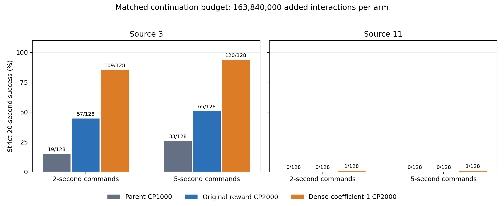
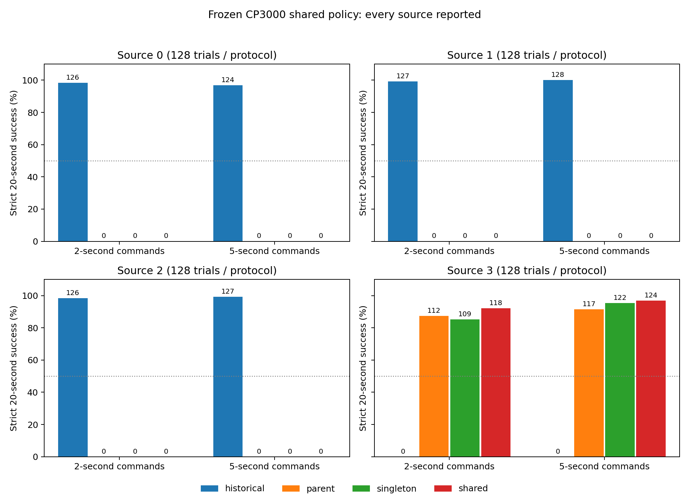

# Wuji 源3/11端点保持：源3改善可复现，源11与多抓姿整合未解决

本轮在独立分支 `feat/wuji-hold-controlled-20260929` 完成核心对照、第二续训种子复验、共享策略对照和冻结评估。源3提高持续定位系数的改善在两次续训种子上成立；源11仍无法稳定保持伸出。单策略整合在源3保持高成功率，但原0/1/2均失败，未达到逐源门槛。未做真机验证。上一轮最终提交 `f332e4e` 及历史成功策略、权重、视频全部保留。

开发机全部计算于2026-09-29 14:22UTC前结束，14:23UTC实查四H100均0%、无计算进程；北京时间22:23已告知用户释放。总预算起点06:08:43UTC，原硬截止18:08:43UTC；核心比较和有价值的后续均完成，提前停止计算，交付余量超过3小时。

- 核心源3同预算：原奖励47.66%，改动89.45%（+41.80个百分点）；第二续训种子24.61%→92.97%（+68.36点）。
- 源11同预算：原奖励0%，改动0.78%，未解决。
- 共享策略：原0/1/2严格均0/128；源3严格2/5秒118/128、124/128。保留历史策略在原抓姿124—128/128。
- 下一步唯一优先事项：从源11现有专家开展到位后拇指保持与非拇指支撑协同的受控修复；同时要求保持端点与刀身稳定，避免直接采用会损伤支撑的脚本固定。当前不再扩展训练或推进真机。

## 先纠正奖励日程解释

上一轮奖励日程的 ObjPosDeviation、ObjRotDeviation、StableContact 起点/终点分别都为 -0.5/-0.02/0；绝对位姿惩罚 coefficient=1、ramp_epochs=0。进度44.4%不会改变这几项权重，不能解释为稳定约束未充分生效。本轮续训是控制组，用于隔离继续优化的效果，不以“补完日程”认定会改善。证据 `receipts/curriculum-correction.json`。

## 已有时序诊断

不新增仿真，复查上一轮两个专家final1000、各32扰动的2/5秒原始时序。全部曾到位与保持到阶段末是不同指标；严格成功仍要求全20秒刀身稳定、存活及每阶段末0.3秒误差<2mm。

|源/协议|伸出阶段曾到位0.3秒|伸出阶段末保持|收回阶段末保持|
|---|---:|---:|---:|
|3/2秒|156/160|86/160|159/160|
|3/5秒|61/64|22/64|62/64|
|11/2秒|153/160|6/160|160/160|
|11/5秒|64/64|0/64|63/64|

主要观测是伸出后回缩，失败端点刀身仍稳定，拇指接触代理多半仍在；不能由相关时序证明奖励、接触或动作接口是根因。源11在5秒失败伸出端平均有符号误差约-12.88mm。目标按每次初始slider加0.04/0米交替，不是固定全局0.04/0；初版离线绝对阈值标签错误已保留为invalid并修正，物理与严格评分未改变。

完整逐阶段CSV、按端点分组及源码/权重哈希见 `diagnosis/`。图取每源第0回合，不挑最佳或最坏。接触是净力二值代理，动作幅度不是接触力。

## 已完成的最小对照

每个来源从同一个原专家CP1000做两组完整状态续训，模型/归一化器/优化器/计数器均恢复；checkpoint没有PhysX状态，因此两组都用新成对seed重置rollout及RNN，不冒充逐位连续仿真。

|来源|控制组|改动组|每组新增交互|
|---|---|---|---:|
|3|原奖励 GoalDistance2=0.1|GoalDistance2=1.0|163840000|
|11|原奖励 GoalDistance2=0.1|GoalDistance2=1.0|163840000|

只提高已有的持续定位项 `exp(-(slider_error/0.002)^2)` 系数；不新增奖励公式、不改Success=50、不改定时目标、不改动作范围/物理/网络/严格标准。现有Success每命令到位保持0.3秒后只发一次，持续定位项在整个命令期间计算；新旧差值上限每步0.9。假设是持续误差反馈可能改善到达后的保持，对照检验其充分性而非预设根因。

每组5120环境、32步rollout、追加1000轮至总CP2000、seed2026092901、span0.04、thumbstep0.025。10轮预检每轮10.6—10.9秒，通过后锁定预算。源内模型、优化器和学习率摘要完全相同；两源原学习率不同但源内匹配。正式命令仅实验名和GoalDistance2权重不同，91个运行源码SHA已保存。预检权重不用于正式起点。

## 冻结评估和选择

主表固定最终CP2000，按相同新增交互比较。另以开发每源32固定扰动、CP1250/1500/1750/2000严格2/5秒等权平均选择，平局取最新；选点表单列，不替代同预算主表。最终每源128新扰动在评估前生成冻结，开发和最终在同一来源用不同随机种子。每源父专家/两条件/选择权重都在同一GPU、同一初态评估；完全相同权重可重用同协议证据并明确标注，不冒充新物理回合。

严格2/5秒：20秒固定时钟，阶段末9控制步误差<2mm，全程alive、刀身平移<10mm及旋转<0.25rad。宽松协议10mm到位换向至少3完整轮，单独记分，不等同严格保持。静态基线单列，既报告全体也报告静态可保持子集。新扰动属于已训练基础抓姿附近验证，绝不是未见基础抓姿或真机泛化；硬限位/端点表现不替代任意内部位置精度。

核心结果触发源3第二续训种子复验和单策略整合，均已完成，结果见后文。原3抓姿的最终扰动在核心阶段未使用；整合测试复用源3已测扰动，因此整合不冒充完全新的独立验证集。

## 核心冻结结果（seed2901，同预算CP2000）

每项128个固定来源附近扰动，固定2/5秒命令、全20秒、每个阶段末0.3秒误差<2mm且刀身全程稳定。原始数据逐文件远端/本地SHA核验，严格评分与独立端点实现交叉复算通过。完整表和逐回合结果见 `analysis-seed2901/report.json`、`trials.csv`、`endpoint-diagnostics.json`。

|来源/策略|2秒严格|5秒严格|两协议均值|
|---|---:|---:|---:|
|源3父专家CP1000|19/128|33/128|20.31%|
|源3原奖励续训CP2000|57/128|65/128|47.66%|
|源3持续定位系数1 CP2000|109/128|120/128|89.45%|
|源11父专家CP1000|0/128|0/128|0%|
|源11原奖励续训CP2000|0/128|0/128|0%|
|源11持续定位系数1 CP2000|1/128|1/128|0.78%|

源3继续优化本身带来+27.34个百分点，系数改动相对原续训再+41.80个百分点；两臂刀身稳定均值99.61%/98.83%，改动降低0.78点。源11没有实用改善。单个续训种子不足以推断所有种子；不能把奖励改动在源3有效推成源11或接触问题的统一根因。

5秒伸出阶段末保持：源3父117/256、原续训162/256、改动247/256；源11父0/256、原1/256、改动4/256。源11改动组全部256个伸出阶段曾到位，但仅4个保持到阶段末；失败伸出端平均有符号误差-14.40mm。收回端源11两续训组均256/256，定位了持续伸出保持仍是瓶颈。

开发选点补充：源3改动选CP1500，最终严格116/128、118/128（均值91.41%），不替代CP2000同预算主表；其余组选CP2000。相同checkpoint/协议明确复用物理证据，核心实际独立物理回合共2944（含静态），报告的策略行3840包含显式复用，不能相加当作独立样本。

## 根据证据启动的后续

预注册条件在结果前记录，核心复算后机械应用，见 `followup-decision.json`。

1. 源3从相同原专家CP1000，以新续训seed2026092902重做原奖励/系数1各1000轮至CP2000。复用原开发/最终扰动，只增加训练随机种子，父专家随机种子和测试集并不独立。
2. 从源3改动CP2000，以seed2026092903做单源继续训练与原0/1/2+源3共享池各1000轮至CP3000，保持同奖励/物理/动作/网络，仅池不同。共享策略不路由专家。源11明确排除，尚未解决。最终CP3000预固定，不用最终集选点；逐源报告并与父专家、保留历史teacher比较。原3记录代表2个近邻簇，不算3个独立形态。

后续于10:32UTC使用重新核验空闲的四H100启动，新增占用事前告知用户，预计释放窗口北京时间22:15—22:45；实际22:23确认全部GPU已释放。各臂新增1000轮/163840000交互，最终CP2000/3000均核验计数器、优化器与有限模型参数。

## 复现与资源

- 入口 `scripts.launch_wuji_hold_arm.py --row 3 --condition original --gpu 0 --additional-epochs 1000 --name NEW_RUN`（使用同一IsaacGym环境）；改动组condition=`dense1`。
- 执行/恢复身份 `scripts.train_wuji_hold.py`；GPU租约及有界看护 `scripts.run_wuji_hold_job.py`；开发/冻结入口 `scripts.evaluate_wuji_hold.py`；独立复算 `scripts.analyze_wuji_hold.py`。
- 父权重SHA、初始化摘要、数据SHA、运行命令见 `receipts/` 与 `data/manifest.json`；预注册 `preregistration.json`；持续交接 `WUJI_HOLD_HANDOFF.md`。
- 新主机10.14.0.107:30296，06:12UTC实测4张H100空闲后使用；未终止其它任务。各卡只有有用训练/评估；利用率和实际PID均带时间，见 `receipts/gpu-history.jsonl`、`monitor-latest.json`。
- 用户命名的附件 `Codex-Goal-Wuji-Hold-20260929.md` 暂未在可见下载/tmp/research找到，已请求路径；当前执行依据是本轮用户消息的明确要求，未声称读过缺失文件。

## 代表视频（父策略，非本轮冻结结果）

在新策略结果出现前固定历史诊断每源第0回合、5秒命令及同一前视相机。实际本机4090重仿真均所有命令曾到位，但严格全程成功均0/1；源3刀身稳定1/1、源11刀身稳定0/1。不同设备、环境数量和重仿真可能造成轨迹差异，这两段不替代旧32或本轮新128结果。见 `video/parent-video-results.json` 和逐回合原始评分。后续最终权重使用同回合对照，不按成功挑选视频。

- `videos/hold-parent-source3-fixed5.mp4`
- `videos/hold-parent-source11-fixed5.mp4`

Release `wuji-hold-20260929-v1` 保存父权重、历史参考策略、全部预检/正式训练权重日志、全部代表视频和原始时序，服务器SHA逐项核验；已正式发布，见 [Release](https://github.com/Jr-kelly/artgym/releases/tag/wuji-hold-20260929-v1) 和 `receipts/final-release-verified.json`。全部训练权重均归档，不只保留开发选中的checkpoint。

## 源11机制干预诊断（不是学习策略结果）

核心源11失败后，在本机4090对已用的同128初态做原策略／外部拇指目标固定对照，2/5秒四项共512回合。达到2mm并连续9步后，脚本将拇指后续增量设为0直到下一命令；非拇指仍由策略输出，物理/范围/网络/严格评分不变。此干预使用真实slider状态，不是可部署策略或新增训练。

|协议|原策略严格|脚本固定严格|原策略刀身稳定|脚本固定刀身稳定|
|---|---:|---:|---:|---:|
|2秒|1/128|36/128|125/128|92/128|
|5秒|1/128|59/128|122/128|87/128|

逐步独立检查连续9步触发、命令切换复位、只修改拇指动作，以及严格评分复算全部通过，见 `analysis-thumb-latch/report.json`。持续拇指增量参与破坏保持有干预证据，但简单固定目标同时损伤刀身稳定，且仍有大量失败；不能把它作为成功修复或认定唯一根因。本轮不替换学习策略，不污染核心奖励对照。这给后续“到位后拇指保持与非拇指支撑协同”诊断提供了依据；结合整合的失败结果，下一步仍优先解决源11到位后的保持与支撑协同，不把本诊断当成功策略。

权重与资产统一索引：`weights-index.json`；下载训练归档后用 `python -m scripts.restore_wuji_hold_run ARCHIVE.tar.gz` 逐文件校验恢复。原始时序归档包含各自manifest与完整评估目录，按保留相对路径解包即可复算。

## 第二续训种子冻结复验

同一源3父专家、相同最终128初态，改变续训随机种子到2026092902。它验证续训随机性的稳健性，不等于两个独立训练出的父专家或新测试集。

|种子/策略|2秒严格|5秒严格|等权均值|
|---|---:|---:|---:|
|2901原奖励CP2000|57/128|65/128|47.66%|
|2901改动CP2000|109/128|120/128|89.45%|
|2902原奖励CP2000|27/128|36/128|24.61%|
|2902改动CP2000|115/128|123/128|92.97%|

第二种子同预算差+68.36个百分点，刀身稳定原254/256、改255/256（+0.39点）。原奖励继续训练明显波动，不能假定延长会单调改善。第二种子开发选原奖励CP1500，最终66/128、58/128（48.44%）；改动选CP2000，同主表。选择结果单列，不掩盖最终控制组退步，也不替换主比较。第一种子差+41.80点、第二种子差+68.36点，只能支持当前两次续训种子与源3邻域内的改善。

证据 `analysis-seed2902/`、`followup-summary/`。全部原始时序与两个独立评分实现交叉复算通过。

## 单策略整合冻结结果

仅改变训练池，源3改动CP2000为共同父权重；singleton源3与shared原0/1/2+源3各追加1000轮，固定CP3000。共同奖励系数1、物理、网络、动作范围保持不变。以下每格为2秒/5秒严格成功，各128初态。

|来源|历史成功策略|源3父专家CP2000|单源续训CP3000|共享策略CP3000|
|---|---:|---:|---:|---:|
|0|126 / 124|0 / 0|0 / 0|0 / 0|
|1|127 / 128|0 / 0|0 / 0|0 / 0|
|2|126 / 127|0 / 0|0 / 0|0 / 0|
|3|0 / 0|112 / 117|109 / 122|118 / 124|

共享策略源3均值94.53%，单源90.23%，父89.45%，分别+4.30/+5.08个百分点；原0/1/2全部失败，逐源逐协议至少50%的预设门槛未通过。父专家原本就不具备原抓姿能力，因此这里是“未能获得原抓姿技能”，不能称为共享训练遗忘了父策略已有的原抓姿成功。历史成功策略仍以独立权重保留，未被替换。

原0/1/2静态刀身稳定125/128、128/128、128/128；共享策略则全为0。复用5秒时序的事后描述显示，三源首次刀身越界中位时间0.233/0.800/0.133秒，早于首个伸出端点；同批历史策略仍稳定且成功。这说明本次整合失败包含早期支撑失稳，不能简单归入源11式伸出后回缩，也未证明奖励、探索或归一化中的任一因素是根因。见 `analysis-integration/body-breach-timing.json`。

来源0/1/2只有两个近邻构型簇；来源3测试集显式复用核心已测扰动。核心和整合评估的并行环境数不同，源3父策略分协议计数会轻微变化（核心109/120、整合112/117），故整合效应使用同一512环境表内的父策略/单源对照。所有结果均是仿真抓姿邻域验证，不能称未见基础抓姿泛化或真机成功。

## 视频、证据与恢复

八段视频均是真实策略仿真，不是轨迹脚本。六段单源采用预先固定历史回合0；两段整合采用每源预定首个最终扰动。两段整合均仅源3严格1/4，原0/1/2失败；画面第一排0/1/2、第二排3。视频来自本机4090的单独重仿真，不代替开发机冻结计数。固定帧0/149/299/449/599已检查，视频原始时序也已独立复算。

- 源3改善代表：`videos/hold-final-source3-dense1-fixed5.mp4`（严格1/1）。
- 源11未解决：`videos/hold-final-source11-dense1-fixed5.mp4`（严格0/1）。
- 共享策略：`videos/hold-integration-shared-fixed5.mp4`；同父单源对照：`videos/hold-integration-singleton-fixed5.mp4`（均仅源3严格成功）。
- 每段结果、配置、源码、哈希及检查帧：`video/`；所有八段和原始归档均在Release中。
- `weights-index.json`索引32个正式CP；每组完整训练归档还包括优化器、额外nn权重、TensorBoard和日志。四核心各17文件、四后续17/17/17/15文件逐文件恢复核验通过。预检、父专家与历史成功策略另存。
- 下载完整训练归档后运行 `python -m scripts.restore_wuji_hold_run ARCHIVE.tar.gz`；下载raw-evidence归档后在仓库根保留相对路径解包，使用 `scripts.analyze_wuji_hold` / `scripts.analyze_wuji_hold_integration` 复算；`scripts.summarize_wuji_hold_followup`生成比较表。相关脚本输出目录必须是新的，避免覆盖证据。
- 手工恢复历史参考资产`wuji-hold-historical-reference.pth`到`runs/hold-20260929/parents/historical-reference.pth`，SHA为`4d8af0637a29787811b5ab2251425ddc79382dce2f84ae00708455b1149890ac`；父专家归档保留原路径。

实际新增物理评估：核心开发1024、核心最终2944、复验开发512、复验最终1664、整合最终6656，共12800回合；另源11干预512、代表视频14，共13326。相同权重证据复用的报告行不计为新增物理回合，同初态重复评估也不代表统计独立；静态计入上述物理总数。详细去重计数见 `followup-summary/report.json`。

## 资源、失败记录与交付边界

8组正式训练各追加163840000交互，合计1310720000；另4组10轮预检6553600交互。开发机总训练占卡26.25 GPU小时（含预检/启动），结束前完整四小时整机平均利用率77.47%，采样覆盖100%，超过40%目标。14:23UTC实查所有本轮计算退出，4GPU均0%/1MiB；自建只读监控14:25UTC停止，其它任务未终止。见 `receipts/resources-final.json`、`remote-released.json`、`monitor-stopped.json`。

实际处理的运行问题：归档等待器读取心跳写入瞬间空JSON退出，保留原日志，增加有界读取重试后完成归档，无训练重启；本机视频打包系统PATH无ffmpeg，改用已有imageio_ffmpeg，已生成文件SHA一致后续接。配置审计本机IsaacGym解析曾失败，远端独立离线解析核验通过；未修改进行中的训练源码。这些故障没有被记为策略失败。

本轮核心比较、条件触发的第二种子复验和整合全部完成，无因资源不足而缺失的核心比较。源11只做一对续训种子；整合只做一个续训种子，不能作跨种子普遍结论。未见抓姿测试、内部任意位置精度和真机均未开展。行为目标只部分达成，源11和统一策略保持未解决；已有成功专家仍是可恢复基线。
