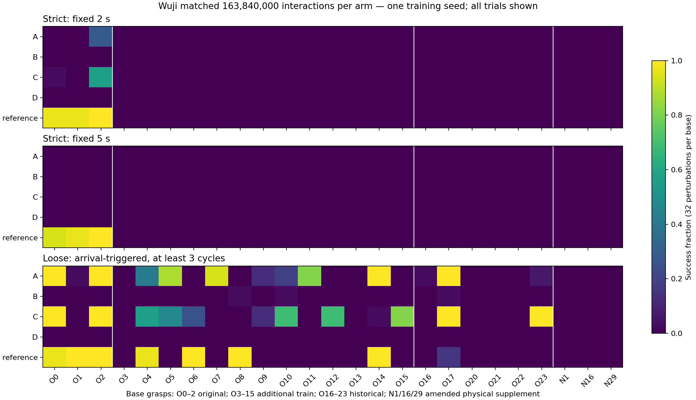

# Wuji 多抓姿 × 非拇指动作范围：实测报告（诊断仍运行）

核心2×2已完成：四组各1000轮、163840000次环境交互、同随机初始化；全部16候选权重已校验备份。800相同初态上的同预算冻结评估16项已完成，12000策略回合已从原始轨迹独立复算。开发择优冻结评估及唯一后续单抓姿专家诊断仍在运行；没有达到多抓姿稳定伸缩的目标，不能接回自主取刀。

## 当前回答

- **增加训练抓姿：** 本轮单种子、同总交互预算下未改善，B/D严格成功均0。B多数能握持却基本不开合；D明显快速失稳。更多抓姿同时减少每个抓姿的采样次数，这个实际效果不能分解为“多样性本身有害”。
- **放宽非拇指范围：** C相对A在原抓姿2秒协议有少量收益，全部800初态严格成功增加1.25个百分点；5秒协议四组均0，新增13训练抓姿和新测试均无严格收益。D未改善B且握持明显恶化。不能凭单种子宣称范围是根因或稳定因果收益。
- **可操作与仅静态保持：** 原训练抓姿仍最可操作，旧teacher在原3×32上严格94/96（2秒）、93/96（5秒）；新策略远低于它。新增13训练抓姿405/416次静态满足刀身门槛，四组与参考严格操作均0；其中有宽松开合，故“只静态成功”不等于物理不可操作。
- **自主取刀：** 不支持重新接入。本轮没有稳定的新多抓姿操作能力，也没有连续取刀终态接管验证；仅旧刀仿真，未替换实测v2、未运行机器人。
- **唯一后续诊断：** 静态稳定的源3/5/11单抓姿专家正在训练。专家成功可证明同物理存在可学方案；失败不能证明物理不可能。最终优先事项等诊断完成后确定，不追加新网络/奖励/形状矩阵。

## 同预算主表：固定CP1000

|模型|严格固定2秒|严格固定5秒|2秒至少首轮开合|10mm到位换向≥3轮|2秒整段存活|
|---|---:|---:|---:|---:|---:|
|A|9/800|0/800|143/800|239/800|584/800|
|B|0/800|0/800|1/800|3/800|666/800|
|C|19/800|0/800|125/800|244/800|490/800|
|D|0/800|0/800|0/800|0/800|1/800|
|reference|94/800|93/800|209/800|227/800|517/800|

A=原3、span.04；B=更多16、.04；C=原3、.20；D=更多16、.20。reference为旧成功teacher，训练预算不同，仅附加参照。原3包含2个近邻构型簇，更多16包含15簇，不把记录数当独立构型数。每个基础抓姿32次扰动不是32个独立抓姿。一个训练seed=2026092801；无独立矩阵种子复验。

严格固定时钟：20秒按2/5秒交替伸出收回，每阶段末0.3秒滑块误差<2mm，全程刀柄平移<10mm、旋转<.25rad且存活。宽松协议为10mm到位立即反向，≥3完整轮，独立物理运行；其循环成功不包含严格握持约束。端点处存在硬限位，未测内部目标，不能宣称任意位置2mm控制。

全部新增训练、历史保留及补充新抓姿的严格成功均0，包含静态稳定子集；C的严格收益局限于原训练2秒条件。宽松到位换向在历史诊断集A/C有提高，但不满足严格稳定要求。D固定协议799/800终止，终止者中位0.467秒，所有800次刀身越阈值；这是失败时序，不能仅凭它证明动作范围的因果机制。

## 冻结选择与初态有效性

开发集为16训练记录×8固定扰动，CP250/500/750/1000分别2/5秒严格率等权，平局latest。选择A750/B1000/C750/D1000；分数分别3.125%/0/2.344%/0。最终未见数据没有用于选CP。主表固定1000，部署候选表另用开发选择，避免把不同CP步数当同预算证据。

最终25基础×32=800初态，四模型冻结后生成；22逐位唯一历史来源（原3＋新增13训练＋6历史诊断）和3补充新来源。静态687/800存活，656/800刀身严格稳定。按基础等权报告全体、静态alive子集与静态stable子集；无有效样本的基础不强写0%操作成功。分层分母见 `receipts/final-static-validity.json` 和 `final1000-analysis/report.json`。

新测试来源：首批seed2803生成1000，24初筛、21静态存活、姿态＋拇指行程0合格。第二批seed2805生成3000，53初筛、49静态存活、3姿态/行程/刀身稳定合格；原“≥3非拇指二值触觉95%”门禁仍0合格。该净力代理也拒绝旧参考成功记录0/2，不是可操作性必要条件。因此在任何新抓姿策略评估前，把全部仅失败此代理门禁的行1/16/29冻结为**补充修订物理筛选集**，标签`new_unseen_amended_physical`。原门禁0保留，不冒充原预注册盲测。补充3×32仅42静态alive、30严格stable（来自2基础）；全部策略在这30稳定回合仍无严格成功。此经验范围不代表动力学吸引域。

扰动：手物平移每轴±0.5mm、旋转向量每轴±0.5°、关节±.01rad并限幅。构型距离分开用mm/正确旋转角/关节RMS，未用75维L2当物理距离。接触信号顺序thumb/index/middle/ring/pinky；关节顺序index/middle/ring/pinky/thumb。触觉净力是代理，不能识别每个物体接触或建立因果先后。

## 复现与证据

- 代码分支 `feat/wuji-multigrasp-2x2-20260928`；逐次执行历史 `progress-history.md`，续接 `WUJI_MULTIGRASP_HANDOFF.md`。
- 旧刀URDF SHA256 `5229c66b183cc6da04190bf2d6cfbd035fadd227340dc8f26602b207171b461c`；teacher SHA256 `4d8af0637a29787811b5ab2251425ddc79382dce2f84ae00708455b1149890ac`。
- 训练初始化全张量SHA `bdf13bb79563529617cba46355011a9d857f1fdefe13f2a8279de8a0458f66b4`。原始完整配置 `configs/`，分组哈希 `data/manifest.json`，阈值 `preregistration.json`。
- 单臂复现：`python -m scripts.reproduce_wuji_multigrasp --arm A --gpu 0 --name NEW_UNIQUE_RUN`；环境用已有IsaacGym运行时，先IsaacGym后torch，`scripts.monitor_wuji_checkpoints.runtime_environment`设置库路径。
- 冻结主表：`python -m scripts.evaluate_wuji_multigrasp_frozen --states research/multigrasp-20260928/data/final-cohort-v1/states.npy --manifest research/multigrasp-20260928/data/final-cohort-v1/manifest.json --gpu 0 --label NEW_LABEL --selection final1000`；另选`development`复现择优表。
- 下载四个`wuji-multigrasp-?-checkpoints.tar.gz`与`wuji-historical-reference.pth`后，执行`python -m scripts.restore_wuji_multigrasp_weights --downloads DOWNLOAD_DIR`，逐份验证SHA并恢复相邻epoch元数据和开发冻结记录。
- 原始CSV/逐基础及逐回合时序 `final1000-analysis/`；小体积评估JSON和配置 `evidence/`。大trace及全部16权重按模型分包到Release `wuji-multigrasp-20260928-v1`，SHA核验收据随`receipts/`，当前草稿上传中。
- 成功视频 `videos/A750-original-base2-three-perturbations.mp4`：本轮开发选定A750，同一原base2的3扰动，实际3/3严格成功、五完整开合周期；不是3独立抓姿泛化。
- 失败视频 `videos/A1000-three-grasps.mp4`：选最终行70/96/352代表性重仿真，实际0/3全严格、2/3alive；第一格连续开合但最后端点没保持、第二格掉刀、第三格刀身不稳。批量/设备不同，非800env精确重放。旧参考成功视频 `videos/reference-three-grasps-policy.mp4` 保留。每个视频的权重、输入、动作控制与筛选说明见manifest。

## 资源与边界

开始2026-09-28 14:53:52 UTC，截止09-29 02:53:52 UTC，至少末一小时留交付。四H100各卡串行；训练A/B/C/D墙钟与实际GPU占用日志在各job状态及GPU采样。19:14最近4h整机本方时间加权79.60%，非平台直接口径；只运行训练、筛选、评估等有用计算。D原训练PID持续，因实测吞吐更换看护延长上限，未重启优化器/随机数/训练；终结按PID退出+最终CP+MAX EPOCHS日志核验，exitcode不可恢复。所有基础设施失败保留并修复，不算方法失败。

本轮源码/资产、训练拟合、冻结评估、离线独立复算、脚本视频与真机严格分账。无student蒸馏、无v2型号泛化、无任意位置控制、无取刀接管或机器人成功主张。
