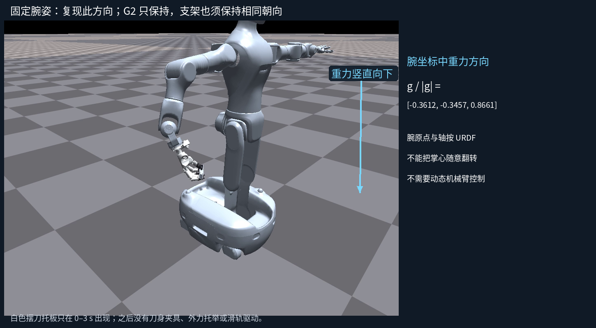
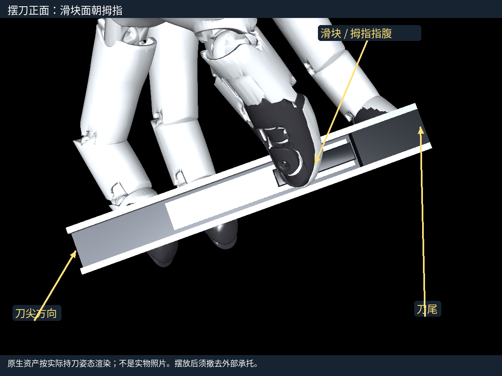
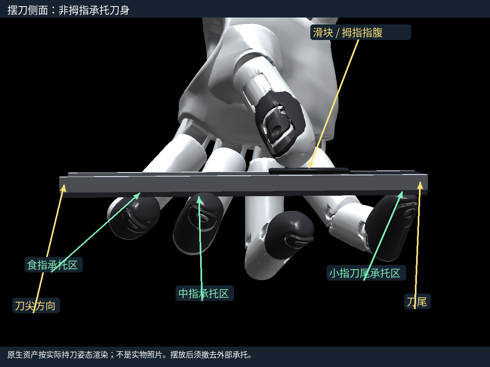
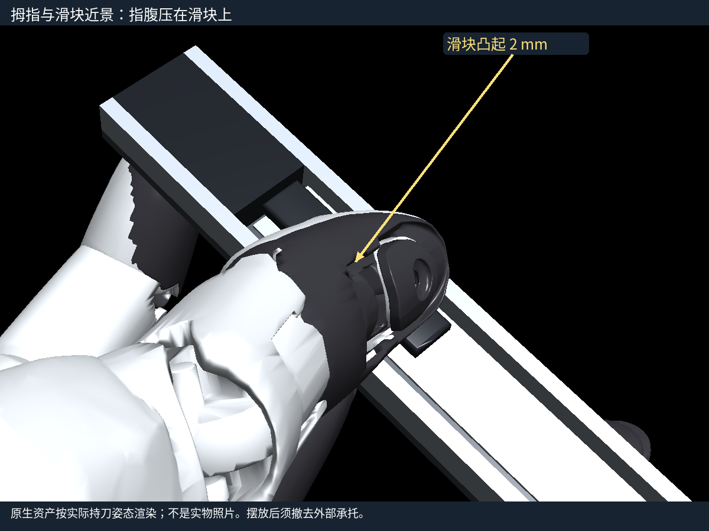

# G2 + WuJi 一代右手：第一次固定握姿后段实验

本轮已实现完整软件入口并通过固定腕姿仿真；真机未连接、未使能、未发送运动命令。实际运行根为 `/data/research/artgym-experiments-20260921/rear-sim2real-20261009`。原桌面取物、换握副本仍保留。目标是人工摆刀后撤去承托，手独立持刀，主动推进超过 20 mm，保持约 1 秒，随后人工确认并停止。

选定配置为 [bundle-deploy-v6.json](bundle-deploy-v6.json)，不是单独一个权重。它绑定 Teacher、R800 Student、既有 update100 残差模型、归一化契约、参考路径、间接按压和路径反馈、20 关节映射、30 Hz 控制周期与摆刀初始参数。运行时哈希不符会拒绝启动。仿真有限 PD 与重力补偿只在仿真执行器中使用；SDK 只接收位置目标，不叠加模拟力矩。

## 1. 接线、环境与固定腕部

连接一代右手的原装供电与 USB。首次上电和使能请现场熟悉设备的人协助；程序不会自动使能、清错或提高 effort 限值。主机是本工作目录所在 Linux 主机，至少需要训练推理环境和独立 SDK 环境。现有 SDK 为 Python 3.10 + `wujihandpy==1.8.0`，路径 `/data/research/artgym-experiments-20260921/contact-transfer-sdk310-venv/bin/python`；已实际导入官方 SDK 检查签名。推理使用现有 `/home/agiuser/miniconda3/envs/artgym/bin/python`，由下列 wrapper 设置环境。两者通过本机专用 socket 通信，SDK 日志与控制消息分开，SDK 子进程清除训练库路径。

```bash
cd /data/research/artgym-experiments-20260921/rear-sim2real-20261009
bash scripts/g2_local_python.sh -m scripts.run_wuji_rear discover
```

本轮本机发现结果为 `[]`。现场连接后读取返回的序列号，设置以下变量；只有这个值确实待填。不要按其他设备的序列号执行。

```bash
WUJI_SERIAL='待填：现场右手序列号'
```

G2 的右腕由现有机器人操作方式固定，或使用相同朝向的固定支架；本入口没有 G2 动态运动后端。按下图保持腕朝向；刀长轴近于水平，滑块面向拇指，食指／中指／小指在相反一侧承托。保持图中重力方向，不能把掌心翻转后照用配置。



实际腕方向和 URDF 坐标关系保存于 [MOUNTING.json](MOUNTING.json)，腕坐标中的单位重力约 `[-0.3612,-0.3457,0.8661]`。这是摆放／安装参照，需现场核实安装件、腕姿和右手一致。

## 2. 只读检查与空手小动作

```bash
bash scripts/g2_local_python.sh -m scripts.run_wuji_rear read \
  --serial "$WUJI_SERIAL" --seconds 3 --output runs/field-read-01
```

查看 `runs/field-read-01/metadata.json` 中右手标记、固件版本／日期、设备实际位置限位和 effort 限值；查看 `control.jsonl` 的错误码、编码器和时间。effort 单位是 SDK 的滤波驱动量 A，不能换称 Nm 或接触力。当前同步 SDK 路径不能读取实时 effort，日志会保留 `actual_effort=null`，不是零。目标位置无固件读回，日志记录 SDK 成功写入确认。

模型顺序为食指、中指、小指、无名指、拇指；SDK 顺序为拇指、食指、中指、无名指、小指，各四关节。名字映射已离线验证，但物理符号、零位和现场限位仍要核对。设备范围只约束实际发令；神经网络归一化始终使用训练时模型范围。

生成本地校准模板，初始是按名字映射后的暂定同符号／零偏置，尚未验证：

```bash
/data/research/artgym-experiments-20260921/contact-transfer-sdk310-venv/bin/python \
  -m scripts.wuji_rear_profiles device-template --output runs/device-provisional.json
```

在现场人员使能、确认空手且没有物体受载后，先检查一个关节。程序不自动使能。`--joint 17` 是模型顺序的拇指第二关节；小动作幅值 0.01 rad，约 0.57°，随后返回。实际符号／零位发现不符时，编辑暂定文件的 `model_from_device_sign`（±1）和 `device_zero_rad`，用同一动作重新核实。模型读数公式为 `q_model = sign * (q_device - zero)`。

```bash
bash scripts/g2_local_python.sh -m scripts.run_wuji_rear check \
  --serial "$WUJI_SERIAL" --motion-authorized --calibration runs/device-provisional.json \
  --joint 17 --step-rad .01 --seconds 2 --output runs/check-j17
```

17已完成，不重复覆盖其目录；其余依次用 `--joint 0` 至 `16`、`18`、`19` 检查对应手指、方向、编码器响应与零位；每次输出目录不同，例如 `runs/check-j0`。各名字可在配置 `runtime_joint_names` 查看。不要通过撞机械端点确认限位；读设备标定限位，并检查本次小动作合法。全部二十关节核对后，以下命令只把**已完成的现场检查**绑定到一个文件；`--operator-confirmed` 表示操作者已观察确认，不会代替现场验证。

```bash
/data/research/artgym-experiments-20260921/contact-transfer-sdk310-venv/bin/python \
  -m scripts.wuji_rear_profiles confirm-device \
  --device-profile runs/device-provisional.json \
  --evidence runs/check-j{0..19} --operator-confirmed --output runs/device-verified.json
```

停止：运行中的运动程序按 `Ctrl+C` 会请求固件失能并写停止原因。也可在结束托住刀后单独执行：

```bash
bash scripts/g2_local_python.sh -m scripts.run_wuji_rear stop \
  --serial "$WUJI_SERIAL" --motion-authorized --output runs/field-stop-01
```

失能会失去持刀支撑，先托住刀。通信失效时用原装供电的断电方式停止；不要把终止 Python 进程理解成固件已失能。

## 3. 按图摆刀

本刀 144×19 mm，刀柄厚约 8 mm，加滑块凸起 2 mm 总厚 10 mm；总重 55 g。滑块 32×7 mm，初始近端边缘距刀尾 30 mm，因此中心距刀尾 46 mm。下图是本轮实际持刀帧的原生资产渲染，不是实物照片，且机械表面简化。







让黑色拇指指腹压在滑块凸起上，避免落在侧缘或刀柄；食指和中指承托刀身中前段，小指支撑刀尾。无名指在此主方案中不是必需承托点。起始图中拇指并不需要逐关节精确等于旧仿真角度，优先确认实际滑块落点、相反侧承托和相同重力方向。标称推动途中最小横向接触边距仅约 0.35 mm，不能承诺大摆放容差。

## 4. 先仅持刀并采集真实历史

```bash
bash scripts/g2_local_python.sh -m scripts.run_wuji_rear hold \
  --serial "$WUJI_SERIAL" --motion-authorized --calibration runs/device-verified.json \
  --seconds 6 --output runs/field-hold-01
```

程序从当前编码器姿态以最多 0.025 rad／控制帧接近摆刀开姿；提示摆刀时，人工放入并暂时托住刀尾，确认后输入 `go`。程序平滑合拢；下一次提示时，缓慢撤去承托并确认，再输入 `go`。此后只靠手保持并采集编码器／已发目标历史。不要在仍由人托住刀时确认已撤去支撑。

刀身持续下滑、滚动、松脱，或拇指没有落在滑块上，表示持刀未建立：托住刀、停止，先调整摆放和承托。此阶段不启用未经检查的压力补偿，也不称作完整推动方案复现。所有实际已发目标均反馈到历史；限幅前的目标单独保存。

## 5. 少量局部受载响应检查

```bash
bash scripts/g2_local_python.sh -m scripts.run_wuji_rear response \
  --serial "$WUJI_SERIAL" --motion-authorized --calibration runs/device-verified.json \
  --joint 17 --step-rad .01 --seconds 2 --output runs/field-response-01
```

同样完成摆刀、撤去承托，然后仅对拇指第二关节做小幅往返，观察编码器响应、刀是否稳定、拇指是否滑脱。必要时在其他拇指关节或不同落点各做一次小检查，保留不同输出目录；不需要先辨识全部物理参数。关节受阻或摩擦也会形成目标—编码器差，不能把差值直接当真实按压力。

若使用测力计，固定测力计／刀的测量工装只用于这个独立校准段，完整推动时必须移除。法向测量沿滑块面的法线，轴向测量沿滑轨，两次分开；尺和视频同时记录刀身移动，避免混合受力。开始／中间／结束姿态分别保持约 1 秒读数。75 gf≈0.7355 N 是用户对这把刀的推动参考点，未给出完整启动与沿程阻力，不是机器人最大推力。

可把力计软件的观测附加到 JSONL，每行含 `host_monotonic_ns`、`station`、`axis`（normal 或 axial）、`force_N`、`source`，可加材料和位移说明。主机时钟采用 Python `time.monotonic_ns()`；与视频拍同一个同步事件。给运行命令增加 `--external-jsonl /实际力计日志路径` 会保存原始读数及对齐年龄，只用于诊断，不进入控制。设备型号／采集驱动本轮未接入，不提供虚构驱动命令。无测力计可以核对接口、持刀和局部位置响应，不能声称法向力已标定。

局部响应确认后，显式启用原有位置形式的按压补偿：

```bash
/data/research/artgym-experiments-20260921/contact-transfer-sdk310-venv/bin/python \
  -m scripts.wuji_rear_profiles confirm-response \
  --device-profile runs/device-verified.json --evidence runs/field-response-01 \
  --operator-confirmed --output runs/field-response-verified.json
```

这个工具要求真实硬件来源、至少 1 秒可测编码器响应和 30 Hz 时延检查；会保留“原模拟有效刚度仍是假设、真实力未标定”。它不等于刚度或真实压力辨识。模型误差短仿真已经失败，因此接着做下述小行程功能检查；若发生滚转／滑脱，不继续完整行程，优先核对实际响应、落点和等效控制模型。不要单纯加压或提高电流上限。

## 6. 小行程试推，再做完整闭环后段

```bash
bash scripts/g2_local_python.sh -m scripts.run_wuji_rear probe \
  --serial "$WUJI_SERIAL" --motion-authorized --calibration runs/device-verified.json \
  --pressure-response runs/field-response-verified.json --output runs/field-probe-01
```

`probe` 使用相同 Student／残差／参考反馈核心，请求 5 mm。它不是开环轨迹回放。观察初期是否保持有效承托、拇指是否仍在滑块上、刀是否开始滚转。小行程若失败，托住刀并停止，记录视频和日志，不直接升级到完整请求。无滑块视觉或触觉传感输入；是否成功由现场尺与视频判断。

```bash
bash scripts/g2_local_python.sh -m scripts.run_wuji_rear push \
  --serial "$WUJI_SERIAL" --motion-authorized --calibration runs/device-verified.json \
  --pressure-response runs/field-response-verified.json --output runs/field-push-01
```

每次都重新接近、人工放刀、撤支撑、采集至少 50 帧真实历史。全网络／反馈预热不发送运动命令，并恢复推理记忆；预热后再采集 50 帧真实历史，随后以 30 Hz 接管。先请求相对 35 mm，再按已知时钟保持末态位置，不要求精确 35 mm，也不回收。用固定在刀柄上的尺／标记和视频确认滑块相对刀柄主动位移 **>20 mm**，末态保持约 1 秒。程序随后继续保持，等待人工确认；托住刀后输入 `go` 结束，再执行上面的 `stop`。退出不自动失能，避免未托住刀就掉落。

连续三次完整读—推理—约束—写入—确认—日志循环超过 33.33 ms，程序会中止并请求失能，不通过降低策略频率掩盖问题。也支持 `--stop-file runs/STOP`；该文件出现会停止。SDK 模拟对象的时延不能代替现场 USB 时延。

## 7. 最少日志与故障处理

每次输出包含 `metadata.json`、`control.jsonl`、`summary.json` 和 `sdk-console.log`。`control.jsonl` 保存模型／设备编码器、限幅前目标、实际已发目标与动作历史、主机时间、SDK 状态、可选力计数据；`summary.json` 保存完整循环时延和停止原因。无电流、切向力或视觉来源的字段明确为空；压力代理不能当测力传感器。

| 现象 | 首先检查 | 对应证据 |
| --- | --- | --- |
| 持刀未建立 | 刀尾支撑、刀面方向、摆放落点 | `independent_hold_history` 阶段、同期视频 |
| 拇指滑脱 | 是否压在滑块内部、受载响应是否改变落点 | `loaded_local_response`／`closed_loop_probe_and_hold` 的编码器与已发目标、近景视频 |
| 刀身滚动 | 食指／中指／小指承托与拇指反作用 | 侧面视频、接管前后关节变化；本轮模型误差失败即此机制 |
| 接触仍在但推进不足 | 尺测行程、实际阻力、关节行程余量、执行响应 | 实际已发／原始目标、设备限位、局部响应日志 |
| 推理或通信滞后 | 30 Hz 完整循环时延、SDK 通信／错误码 | `summary.json` 的时延、`sdk-console.log`、停止原因 |

真正待现场完成的是：右手序列号／固件与安装方向确认、首次使能、二十关节对应／零位／限位核对、撤去承托后的持刀、少量局部响应与 5 mm 功能试推、最终 >20 mm／1 秒尺测视频。本轮未接入 G2 臂控制、实时 effort 上行、在线滑块检测或力计驱动；均不作为伪造的已验证功能。
