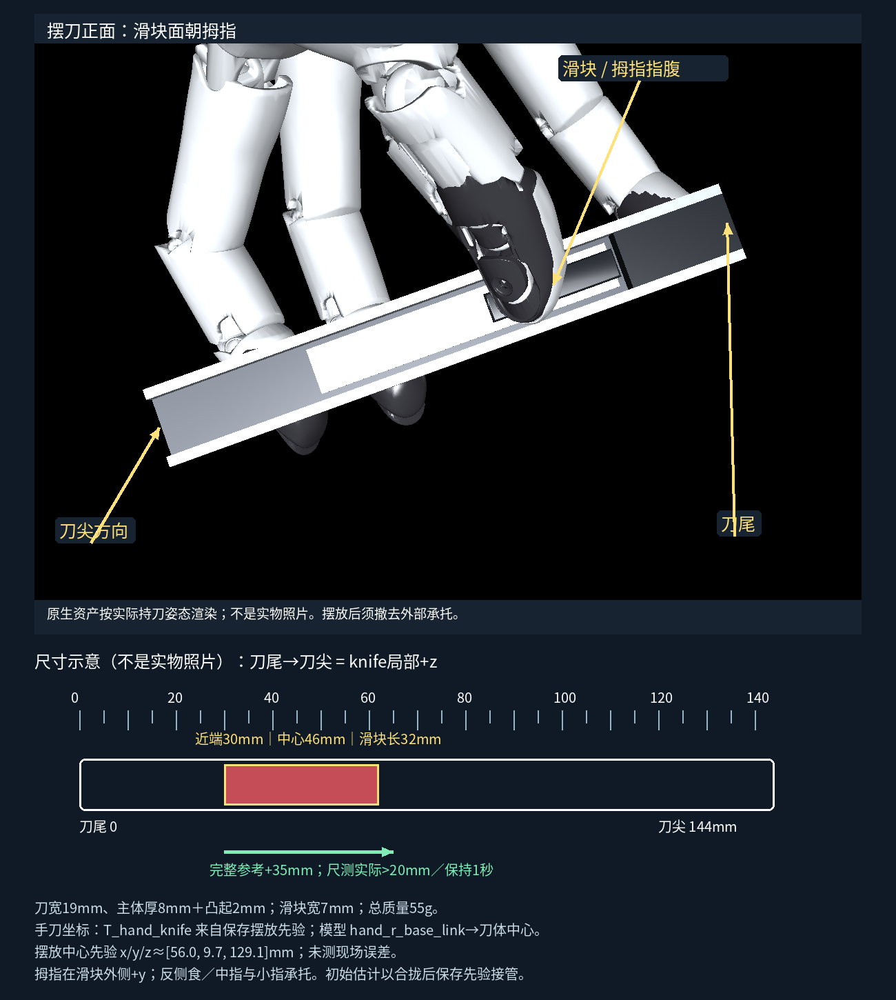

# 当前v4入口

当前默认bundle为v9，真实制造商桥接代码与详细网络/GDT现场指南随私有交付提供。G2入口已实现，但需核验真实配置/新帧反馈/安装/控制权；以下v3手操作、零位和摆刀材料继续有效。选定本轮local controller路径，受载期间remote_env保持不变，GDT状态RPC没有运动输出。见[v4结果](v4/REPORT.md)。

# G2＋Wuji 一代右手首次现场流程（v3）

**整套部署目前仍被 G2 实机接口阻塞。** Wuji 位置读写、使能／失能请求、连续会话已实现；没有对应本机型的 G2 到位／读回／保持后端。`session` 的真实设备入口因此拒绝启动，不会把七个仿真角直接写入陌生 SDK。不要用 `--fixture` 绕过这个阻塞，它完全没有硬件与接触物理。请先执行下面不依赖 G2 运动的准备工作；G2 所需最少资料集中列在末尾。

当前配置 `bundle-deploy-v8.json`，保持既有 Teacher、R800 Student、update100 残差、35 mm 参考与按压代理。新物理全段约32.420 mm／1.03秒保持；一帧延迟等旧失败仍有效。没有实机运行或测力标定。[核查及证据](v3/REPORT.md)。

## 1. 现场电脑、恢复和依赖

Wuji 原装供电与 USB 接**现场 Linux 电脑**，两套 Python 和30 Hz策略都在这台电脑运行，以本机 socket 连接。G2 保持应由该机器人官方控制器在本地连接上负责。开发机 GPU、USB枚举和时延不能代表现场；不通过公网传30 Hz电机目标。官方 G2 控制连接方式尚缺实机资料，暂不能给出真实 IP／端口或到位命令。

使用已验证 contact-transfer／ArtGym 基础目录，下载本轮 `rear-v3-deployment.tar.gz` 和 `restore_wuji_rear_deployment.py`。只需一条恢复命令，不要求逐轮覆盖 v1/v2：

```bash
python3 restore_wuji_rear_deployment.py --base "$ARTGYM_BASE" \
  --overlay rear-v3-deployment.tar.gz --destination "$DEPLOY_ROOT"
cd "$DEPLOY_ROOT"
```

`ARTGYM_BASE` 是已有基础恢复根，`DEPLOY_ROOT` 必须是新的目录。脚本先校验旧权重／资产与所有必需文件哈希，再组合当前源码；基础目录不改动。`RESTORE-RECEIPT.json` 是文件恢复证据，不是推理成功；本轮另在不同绝对路径实际加载模型、推理及启动SDK子进程。

推理依赖仍含已合法安装的 Isaac Gym（必须先于 Torch 导入），现有 Python3.8.20、Torch2.1.0+cu118、NumPy1.23.5、SciPy1.10.1，以及 Hydra／OmegaConf／Gym／PyYAML和仓库 rl_games。现有导入链会经过 tasks、gymtorch、distill；没有把它伪称为纯 SDK 环境。Gym 的 gymtorch JIT 首次导入需要当前推理环境中的 Ninja、编译工具及匹配的 CUDA／驱动。响应作图另需 Matplotlib、Pillow；视频工具需 imageio／imageio-ffmpeg。准确版本及实际路径见 [环境检查](v3/ENVIRONMENT-VERIFICATION.json) 和 `RUNTIME-CONTRACT.json`；Isaac Gym 不随本包再分发。优先复用当前受许可环境，不升级原训练环境。

只读发现／读取／小动作／使能请求／停止只需独立 SDK Python3.10 和 `wujihandpy==1.8.0`（本机 NumPy2.2.6）；不用安装推理全家桶才能枚举手。首次安装可运行：

```bash
python3.10 -m venv "$SDK_ENV"
"$SDK_ENV/bin/pip" install 'wujihandpy==1.8.0'
python3 -m scripts.wuji_rear_field configure --config field.json \
  --inference-python "$INFERENCE_PYTHON" --sdk-python "$SDK_ENV/bin/python" \
  --initial-estimate research/rear-sim2real-20261009/v3/initial-estimate.json
python3 -m scripts.wuji_rear_field envcheck --config field.json --output field-env.json
python3 -m scripts.wuji_rear_field run --config field.json discover
```

`SDK_ENV`／`INFERENCE_PYTHON` 是现场实际环境路径；所有路径、序列号、校准文件、初始估计和G2资料集中在 `field.json`。程序保留 venv 的 `bin/python` 启动路径，不把它解析到 `/usr/bin/python3.10` 后丢失 venv。`envcheck` 核查实际策略导入、Python／Torch／CUDA、SDK版本、USB读写权限和模型／参考／URDF／配置哈希。`[]` 表示没有发现手，本轮开发机就是此结果。检查USB和原装供电；若 `/dev/bus/usb/...` 无权限，由现场管理员按[官方 USB 权限步骤](https://github.com/wuji-technology/wujihandpy/tree/v1.8.0#quick-start)配置，不以root运行策略掩盖权限问题。

在 `field.json` 的 `serial` 填发现的**右手**序列号；私人设备配置保存在现场，勿提交GitHub。读取：

```bash
python3 -m scripts.wuji_rear_field run --config field.json read \
  --seconds 3 --output runs/field-read-01
```

看 `metadata.json` 的 handedness=0、固件版本／日期、实际设备限位与电流限值，`control.jsonl` 的20编码器、错误码、SDK原始系统时间／主机读取窗口。电流A不是Nm或接触力；同步路径 actual_effort=null。SDK 1.8.0的模式、使能寄存器为只写，**没有读回**；成功返回只表示调用确认，没有证明电机到位或真实失能。

## 2. 一次性 Wuji 模式、零位和方向核对

先让熟悉本设备的人确认首次供电、位置控制模式和实际急停／断电手段。在官方固件工具或已有可靠程序中核实位置模式后，填写 `field.json` 的 `wuji.position_mode_verified=true` 与具体 `position_mode_source`（工具／固件版本和证据文件）。没有已核对的模式数值时，程序不猜 `write_joint_control_mode` 枚举、不清错、不提高电流限值。官方1.8.0有[使能示例](https://github.com/wuji-technology/wujihandpy/blob/v1.8.0/example/joint/2.write.py)和[结束失能示例](https://github.com/wuji-technology/wujihandpy/blob/v1.8.0/example/joint/3.realtime.py)；我们实现同一接口，空手时先写当前编码器姿态为目标再请求使能，避免旧固件目标突然生效：

```bash
python3 -m scripts.wuji_rear_field run --config field.json enable \
  --motion-authorized --empty-hand-confirmed --output runs/field-enable-01
```

输出 enable_write_ack=true、enabled_readback=null 是正常软件结果；现场还要观察电机建立保持，再进行小动作。发现旧控制程序正在写 Wuji，先在那个程序中正常结束；本程序的序列号写端锁能阻止本入口重复写端，不能替代对其他官方软件的控制权管理。G2官方保持与Wuji分别保持控制权，手的退出不驱动G2失能。

20关节完整命名表见 [NAMED-TARGETS.json](v3/NAMED-TARGETS.json)：模型顺序食指、中指、小指、无名指、拇指；SDK数组顺序拇指、食指、中指、无名指、小指，各四关节。单位rad，公式 `q_model=sign*(q_SDK-zero)`，逆变换 `q_SDK=sign*q_model+zero`。这里是 **SDK公开位置**，不是裸电机寄存器；官方SDK本身处理部分J1反向，不要再盲目加一遍裸电机符号。

绝对零位来自这只手的厂商／设备校准或已知可观察参考姿态。导入程序不负责凭空生成零位。使用命名CSV，无需手算零偏：若采用参考姿态，把厂家定义的 `known_model_reference_rad` 和对应SDK `measured_device_reference_rad` 填入，程序计算零偏；若设备正确工厂标定，可直接填有依据的 `device_zero_rad`。证据必须说明该硬件定义与训练 `assets/hands/wuji_artbot/right.urdf` 相对应；只有仿真URDF或二十关节都动过，仍不足以证明物理零位。

```bash
"$SDK_ENV/bin/python" -m scripts.wuji_rear_profiles reference-template \
  --output runs/zero-reference.csv
# 按厂商/可观察参考填20个命名行、sign、零位或两列参考读数及zero_verified。
"$SDK_ENV/bin/python" -m scripts.wuji_rear_profiles import-device \
  --reference-csv runs/zero-reference.csv --zero-source factory_calibration \
  --zero-evidence runs/factory-zero-evidence.json --device-read runs/field-read-01 \
  --operator-confirmed --output runs/device-imported.json
```

`factory-zero-evidence.json` 是现场已存在的校准／定义证据，不能用模板填假。若使用厂商定义或观察姿态，分别选择 `manufacturer_definition` 或 `observed_reference_pose`。初始CSV的zero_verified=false会被拒绝。小动作后才置 axes_verified；绝对零位仍单列来源及SHA。导入还记录真实30Hz只读日志中SDK不透明系统计数器逐样本前进的证据；单位未确认时不猜tick比例。没有该证据，受载实时入口拒绝运行；普通只读检查使用更宽的2秒冻结检测，避免把未确认的计数器尺度误当20ms时钟。

`field.json` 的 `calibration` 先设为 `runs/device-imported.json`。确认**已取下刀且空手**后检查命名关节；17是拇指第二关节，.01rad≈0.57°，往返：

```bash
python3 -m scripts.wuji_rear_field run --config field.json check \
  --motion-authorized --empty-hand-confirmed --joint 17 --step-rad .01 \
  --seconds 2 --output runs/check-j17
```

其余使用0–16、18、19及各自 `runs/check-jN`，观察名字、正方向及编码器响应，不能撞端点。改映射会使对应日志失效；只把使用最终一致映射的检查作为证据。读设备标定限位，无故不重新归零。一次核对后复用，不每轮检查20个关节：

```bash
"$SDK_ENV/bin/python" -m scripts.wuji_rear_profiles confirm-device \
  --device-profile runs/device-imported.json --evidence runs/check-j{0..19} \
  --operator-confirmed --output runs/device-verified.json
```

将 `field.json.calibration` 改成 `runs/device-verified.json`。确认入口要求独立零位证据、20个方向检查、同一设备身份和相同映射；限位变更会拒绝复用。`open_q_rad` 是摆刀目标；`hold_target_rad` 是含受载预载的电机目标，**不是实际接触时q**。原控制已有15mrad关节保留余量，命名表显示持刀目标的这项改变量。设备范围若让已验证开姿／握姿／完整轨迹再改变，会报具体关节和差值，不能静默剪成另一动作。field.json还集中记录20个有厂商／固件依据的hardware_max_joint_speed_rad_s及speed_source；.025rad/frame（上限.75rad/s）是软件模型上限，不是实机已确认速度。若实机可用速度低于冻结全段需要，会拒绝复现，不能放慢完整动作掩盖动态风险。运行时raw、成功已发目标、限幅变化及真实动作历史都写日志。

## 3. G2目标与安装坐标：此阶段当前阻塞

七个模型关节依次 `idx61_arm_r_joint1` 至 `idx67_arm_r_joint7`，角度和模型限位已导出。`idx61`等数字不能当真实SDK数组ID。表中 hardware_sendable=false；没有实测arm q，也没有确认到位。

模型终端参考是 `hand_r_base_link`。完整固定链包含躯干／底座锁零、`arm_r_end_link` 和安装件；表给出逐段矩阵。实机应核对 `T_hardware_base_model_base × FK(q_actual, torso_actual) × T_verified_mount`，不能拿 sim world 当实机base，不能默认躯干实际为零。保存policy prior与目标角FK分开：后者相差约1.25mm、0.00328rad；保存值来自有限执行器仿真，不是现场测量。`MOUNTING.json` 重力向量 `[-.3612,-.3457,.8661]` 是policy prior；目标角FK约 `[-.3615,-.3485,.8648]`。当前没有已验证的腕姿泛化容差，不把这项微小仿真差异推广为实机允许误差。

G2只有在官方接口完成当前→预备姿态的有界轨迹、实测到位、固定保持及控制权核对后，才允许放刀。右臂保持不能随着Wuji退出失能下垂；躯干和其他关节由官方控制器保持。可以整体平移工作区，但手相对重力方向和手刀布局必须核实。此处没有未实现的假命令；当前真实 `session` 会明确报G2阻塞，提供资料后由我补适配，无需你自行写底层。

## 4. 摆刀与初始估计



刀144×19×10mm，主体约8mm＋滑块凸起2mm，总质量55g；滑块32×7mm。刀尾→刀尖是knife局部+z，宽为x，滑块外法向为+y。滑块近端距尾30mm，中心46mm。拇指指腹落在凸起内部，食／中指承托刀中前段，小指承托刀尾；[实际承托侧视](media/side-annotated.png)、[拇指近景](media/thumb-slider-annotated.png)、[腕部重力参照](media/mounting.png)。图是仿真资产渲染／尺寸示意，不是实物照片。临时托板仅用于摆放和合拢，独立保持前完全撤去。

`initial-estimate.json` 提供单位mm、knife_body_initial局部frame、握姿和来源，默认人工尺对齐先验，**未测摆放误差**。配置 `field.json.initial_estimate` 指向此文件。已测摆放偏置可通过一个入口修正：

```bash
python3 -m scripts.wuji_rear_field estimate --offset-mm 0 0 0 \
  --slider-edge-mm 30 --source manual_ruler_alignment_unmeasured \
  --output runs/placement-estimate.json
```

将文件名填入field.json即可，不编辑深层矩阵。xyz偏置在knife局部，程序同时平移刀／滑块初始估计，滑块边缘偏置沿+z；不把模拟真值改名成现场观测。标称最小接触边距约0.35mm，不承诺人工可做到0.35mm精度。重新拿刀、复位滑块或换摆放时，确认相同估计／30mm边缘并建立新历史。75gf≈0.7355N是实物参考点，不是沿程阻力曲线或手指最大推力。

## 5. 连续持刀会话及合法接续

以下是**已实现**的Wuji会话命令；当前实机因第3节G2缺项拒绝，不提供假成功路径：

```bash
python3 -m scripts.wuji_rear_field run --config field.json session \
  --motion-authorized --empty-hand-confirmed --output runs/field-session-01
```

接口接齐后，向导按实际阶段运行，保持同一Wuji连接和已发目标。只在放刀／撤托／视频判断／取刀等必要交接输入go：

1. 重启不恢复受载记忆。先真正卸载，再用empty-hand-confirmed声明空手；从编码器开始有界开姿过渡，等待放刀。持刀状态不能启动第二个进程或重新执行开手命令。
2. 放刀后3秒合拢，等待撤去外托，独立保持并采集新的实测历史。policy网络尚未发推动命令；补偿已构造但保持／response阶段不施加推动校正。
3. 同一目标与连接下进行1秒静载＋2秒.01rad拇指第二关节往返＋1秒恢复，回到原已发持刀目标。后台分析另开进程，主循环继续保持，查看 `analysis/response.png`／`analysis.json`。
4. 编码器有可测响应、方向正确、无滚转／接触改变且完整response循环合格，操作者确认后仅允许临时模型补偿与probe。静态目标−编码器差、动态去偏置误差、位置幅度、主机IPC时长分别看。`lag.status=unable_to_reliably_estimate`就保留原因，不填伪毫秒。压力proxy不是测得的接触力，原等效刚度仍是假设。
5. 接管前重新采集50实测帧，隔离全网络预热不发命令、不改历史／RNN／参考，之后再采集50实测帧。普通人工等待／后台分析不重建预载，也不快速补发过期动作。
6. probe保持原35mm目标和完整动作前4mm的速度（约1.04秒），随后约.19秒减速至参考5mm并保留末态已发目标。尺测实物正向行程、近景落点、侧面滚转及至少1秒保持；失败输入stop，不进入完整任务。旧一帧延迟短推约−1.878mm已失败，短推不代表全段可靠。
7. probe已经改变滑块初态。向导继续握持，等待**完全取下刀**；将滑块近端复位30mm。确认卸载后才开姿、重新摆刀、合拢／撤托并用新policy记忆及实测历史进入完整推动，禁止直接重置时钟从probe末态跑原参考。
8. 完整请求35mm，真实验收是滑块**相对刀柄主动行程>20mm、保持约1秒**，不要求精确35mm。保持期间用固定于刀柄的尺／标记和手机近景＋侧面连续视频判定；开始录制时拍日志时间／输出目录。代码没有在线滑块真值，不自动宣称成功。
9. 完整推动后仍握持，先托住并完全取下刀，再go正常结束，请求Wuji失能并关闭连接。日志区分disable_write_ack和实际失能未测。G2官方保持不受手进程结束影响。

同一设备已验证校准可复用。现存独立hold/response/probe/push入口也要求先卸载再初始化，并在正常结束等待取刀后请求失能；旧“hold结束仍夹刀、紧接另一个命令自动开手”流程已删除。暂停阶段保留最后成功已发目标；退出后无法用编码器恢复预载，务必卸载重启。

## 6. 停止、时序与日志

正常取刀前保持；取刀后disable。Ctrl+C、stop输入、EOF、stop-file或通信／错误码／陈旧数据／时序异常均进入异常分支，记录原因并请求失能；突然失能可能失去持刀支撑，现场先托刀并准备设备实际急停。没有通信就不能保证停止请求生效，不能把kill进程当硬件停止。Wuji可用原装供电的现场断电手段，G2只能用其已核对官方急停／停止方式。

```bash
# 优先在当前会话Ctrl+C；也可由另一终端生成当前会话指定的stop-file。
# 没有活动写端、已托住/取下刀时，可单独请求Wuji失能：
python3 -m scripts.wuji_rear_field run --config field.json stop \
  --motion-authorized --output runs/field-stop-01
```

写端锁拒绝并行stop进程夺取正在运行的会话；活跃会话应在自身处理停止。30Hz逻辑时钟不变，超期不赶发；错过完整周期、读／确认超过两周期、系统时间倒退／长期不变或三个完整循环连续>33.33ms，会中止。偶发慢帧照实记录，不把p95好看当动态可靠。循环暂缓Python循环垃圾回收，卸载／加载的明确暂停才做回收；引用计数清理照常。没有证明旧尖峰全由垃圾回收导致，也不能保证现场没有主机调度尖峰。

每次新输出目录含 `metadata.json`、`control.jsonl`、`timing.jsonl`、`session-events.jsonl`、`summary.json`、`sdk-console.log`，session另含response固定快照／analysis／临时response profile。逐帧关联实测q、SDK成功下发目标、实际历史动作、阶段／摆放代数、初始估计来源、补偿状态、读取窗口／确认时间、循环成本和停止原因。G2 actual_state为空且标blocked，不能以目标冒充读回。外部力计JSONL仅增量有界读取；仍是时间对齐输入，未实现力计驱动或真实力辨识。

故障先看：无法开握姿→命名／零位及target-compatibility差值；无响应→错误码／使能／位置模式／现场限位；滚转滑脱→侧面承托／拇指落点视频；推进不足→相对尺测／实际阻力／行程余量；周期异常→SDK时间、主机IPC与记录分项。不要增压、改电流上限或启动训练掩盖故障。

## 7. G2阻塞所需最少资料

请集中提供：**这台G2的准确型号和控制软件版本；一个当前能运行的官方“读状态＋右臂到位并保持”示例或相应SDK文档；现场电脑OS/GPU及其连接G2的方式，并附一份命名关节／躯干／腕frame只读状态和G2→Wuji安装件图**。已有材料只证明G2_t2_crsB仿真资产、另一个G2A应用和WujiSDK，不能推出真实关节ID／单位、轨迹限速、控制权、保持周期、真实base/法兰坐标及停止语义。无需你编适配代码；收到这些具体输入后才能补真实G2后端。Wuji零位／模式／受载响应和尺测属于上述现场步骤，不把模板当现场证据。
