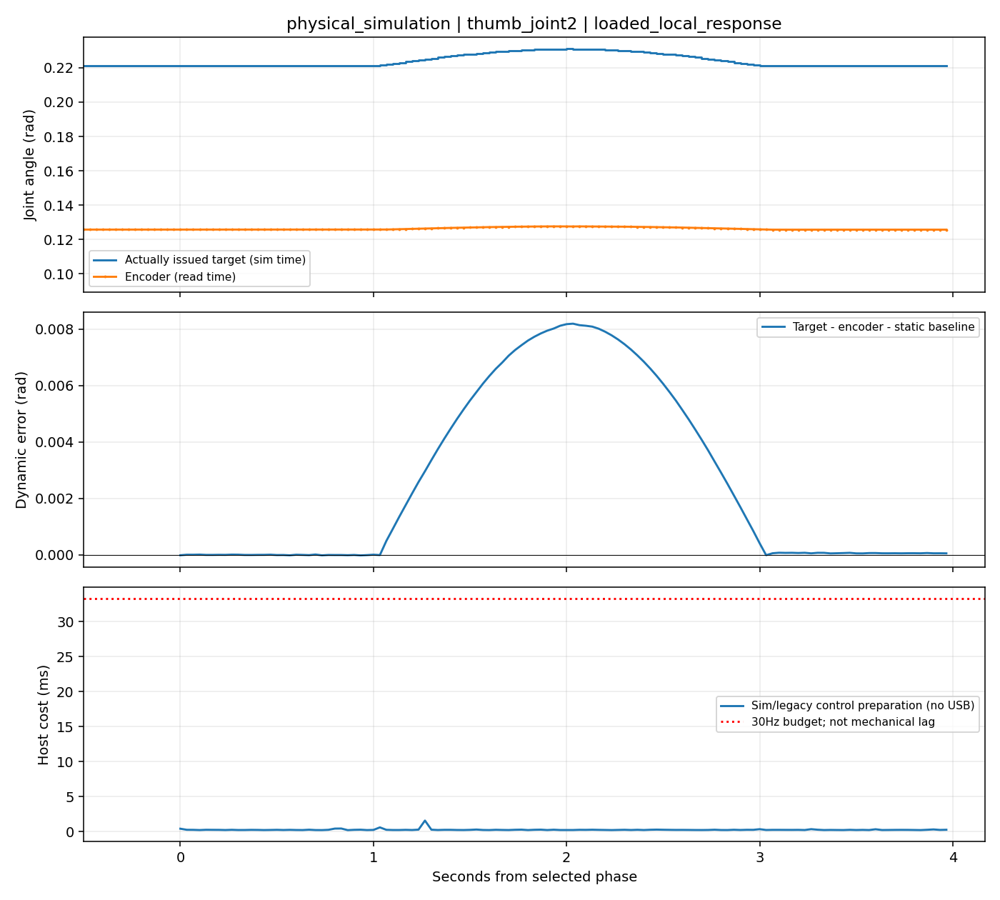

# 短试推与响应诊断：v2结果

当前共享入口默认 `bundle-deploy-v7.json`，新握姿／模型／完整推进参数都未更换。只新增三条物理仿真：标称短试推、一帧延迟短试推、同现场response激励的标称受载响应；旧完整任务与配对失败轨迹复用，没有训练、前半段开发或矩阵重跑。真机未连接、未运动，实物响应输出待现场产生。

## 短动作实际结果与决策

旧probe把35mm改成5mm但保留4秒quintic，因此参考速度约低七倍；旧SDK fixture只能证明调用链，不能作为物理验证。本轮移除缩目标做法：Student／残差仍接收完整35mm目标，参考前4mm时序保留（1.0398秒），之后用连续速度／加速度的时钟减速，约0.1943秒到参考5mm，1.2341秒后进入最后已发目标保持。没有重启目标、压力状态、参考、RNN或历史，没有滑块真值在线停止。SDK与物理仿真均调用同一 `ShortProbe`／`RearController`。

| 新物理检查 | 真实主动位移及保持 | 失效与决定 |
| --- | --- | --- |
| 标称0.7355N、完整物理摆放／撤托／历史／接管 | **4.5145mm**，对参考5mm误差 **−0.4855mm**；最后1秒范围 **0.0273mm**，最小4.5009mm | 通过预先定义的有界诊断；刀身最大漂移6.68mm、转角0.405rad，拇指和非拇指接触均100%，无限位超界。不能代替整段可靠性证据 |
| 仅额外一帧33.33ms执行延迟，其余标称 | **−1.8782mm**；最终虽静止，未主动推进，因此失败 | 推动开始后 **0.8667秒**首先超过0.6rad滚转边界，**1.1667秒**开始持续失去滑块接触；最终滚转3.108rad。失效在减速前，说明短动作没有用慢速掩盖这项风险 |
| 同现场局部响应：先静载1秒、拇指第二关节0.01rad／2秒往返、恢复1秒 | 保持承托／接触，刀身转动仅0.00085rad；这不是滑块任务成功 | 提供匹配受载响应对照，不是刚度／力辨识 |

短动作验收预先保存于 `ACCEPTANCE.json`：有真实正向进展、平均实测距参考误差≤3mm（2–8mm窗口）、最后1秒最小≥1mm且波动≤2mm，接触／承托成立、无滚转失载和限位超界、已发步长≤0.025rad。工程诊断窗口尚未由实物标定；没有把>20mm评分套到短动作，也没有调整请求来凑实际5mm。

已验证标称短动作减速前的所有已发目标与旧v6完整物理记录逐帧**零差异**，当前完整控制核心重放旧380帧也零差异。完整分支没有改变控制行为，故未重跑完整任务；原32.420／28.447mm视频与结果继续引用v1。原单独低刚度、单独延迟、联合误差失败仍有效。没有用短动作通过推断整段或其他执行器条件通过。

## 响应分析现在能回答什么

实际命令与输入文件路径见[现场指南](../FIRST-HARDWARE-SESSION.md)。`scripts.analyze_wuji_rear_response`直接读取现有日志，生成 `response.png`、`analysis.json`、带原始时间戳和已发命令的 `aligned-timestamps.jsonl`。同时区分SDK fixture／物理仿真／实际硬件，不使用电流或位置误差推算N或真实刚度。

这是拇指第二关节的实际有限执行器仿真：目标往返幅度 **0.0100rad**，编码器 **0.001934rad**；动作前静态目标—编码器差 **0.09533rad** 单列。减去该静态偏置后的跟随RMS **0.004082rad**，恢复静态差变化约 **0.000059rad**。受载约束与接触会改变编码器幅度；0.193幅度比不代表0.193倍刚度，95mrad静态差也不是95mrad的动态延迟或真实法向力。

滞后算法扫描整数采样步，保留完整拟合曲线与分辨率。单次缓慢往返缺少独立时间特征／重复，当前物理样例输出 **无法可靠估计**；可以保留“最佳形状拟合位置”，但不当作可靠机械毫秒数。旧延迟／低刚度完整任务已分析：反馈改变命令、接触丢失、波形不匹配，均不能用单关节互相关辨识物理延迟。已知95mrad偏置、零／一额外采样步的丰富离线信号测试可正确区分方向与采样步，属于算法测试，不计作物理成功或硬件标定。

现场比较相同激励时，可以检查命令是否执行、方向和幅度、静态受载差、去偏置动态跟随差及恢复偏置。若接触／承托变化，优先处理摆放；若相同波形下接触稳定却跟随明显不同，才把固件、等效执行器响应／延迟列为后续诊断对象。不能仅凭位置日志区分摩擦、负载、刚度与力，也不能用闭环任务形状误差的大小直接推出成功或失败。

主机每帧的SDK读取时间窗口、成功写确认、计算、IPC及日志各自保存。完整读—算—写—确认—control记录耗时通过 `cycle_id` 写入 `timing.jsonl`；该微小记录自身成本包含在下一条control的 `previous_cycle_end_to_end_ms` 和summary，避免把完整指标只留在内存。IPC包括调度和SDK调用，无法分离纯USB往返；调用耗时小于33ms不代表机械无一帧滞后。新读模式fixture核对了真实SDK调用时间包络字段；response／probe模拟接口逐帧日志关联完整，probe完整循环p95约6.73ms、最大12.77ms，这不是现场USB时延。

`confirm-response`改为 `position_response_recorded`、`bounded_probe_permitted`、`normal_force_calibrated=false`、`full_action_reliability=not_established`，并自动保存分析。它支持显式临时补偿下的有界诊断，未标记模型已匹配。没有额外审批文件或力标定假象。

## 材料与现场下一步

[双视角连续短动作视频、失败视频与响应图](review.html)。两条各12.667秒、380帧，已检查按时间排序的撤托、接管、减速、保持／滚转失接触关键帧，并核对原始接触／行程／命令记录。原完整视频直接复用v1；没有SDK动画、目标回放或状态快照作为新物理成功。

首次仍按图固定腕向，连接原装供电USB，现场协助首次使能；`discover` → `read` → 二十关节小动作／profile → `hold` → `response` → `analyze_wuji_rear_response` → 显式临时补偿profile → `probe`。先记录实际尺测位移与保持、近景接触和侧面滚转、固件／限位、完整循环原始时间戳。若短动作失败或分析出现明显异常，不继续完整推动；短段正常也只支持继续有限功能检查。真正未解决的是执行器敏感性和现场受载动态，当前没有任何真机成功、真实按压力标定或完整动作高成功率声明。

[源码分支](https://github.com/Jr-kelly/artgym/tree/feat/wuji-rear-sim2real-20261009) · [v2增量／证据／视频材料](https://github.com/Jr-kelly/artgym/releases/tag/wuji-rear-sim2real-20261009-v2)。所有343个固定依赖在恢复组合中逐项SHA256核验，旧权重不重打包。
